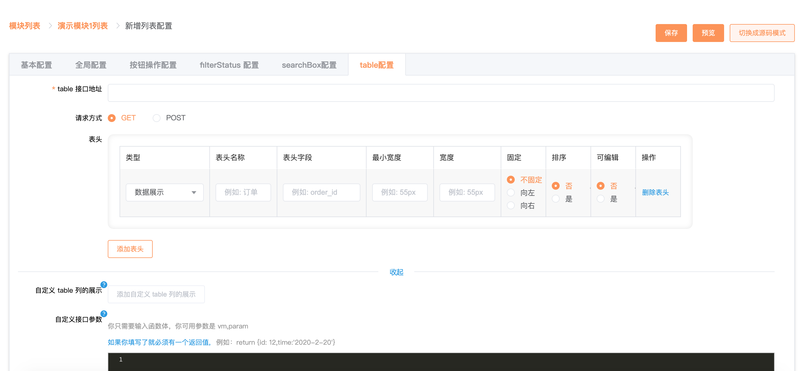

# 中后台列表搭建设计思路

## 为什么要做页面可视化搭建系统

* 统一微前端架构各个微应用页面的样式和交互

  我们公司的供应链 saas 系统而多个独立部署、技术栈不统一的系统组合而成，这些系统的样式，交互存在差异，通过页面可视化搭建系统生成的页面底层使用同一套组件，这可以满足样式，交互一致，并且面对之后的样式和交互变更满足批量修改

* 缩短常规页面开发时间

  我们公司的供应链 saas 系统是一个 toB 系统，这里面存在数量可观的类似的页面，开发重复页面容易磨灭开发人员的积极性，整理各类页面的共同之处，通过可视化搭建系统来减少页面开发重复度，让开发人员集中精力开发逻辑复杂的页面

可创建的页面类型有：列表、详情、表单。详情和表单页的设计思路差别不大，列表页与另外两种页面差别比较大。本篇文章先介绍列表页的设计思路再介绍详情页的设计思路

## 列表页设计

经过分析我们公司的列表页布局有一个统一的模式。列表由右上角的操作按钮、左上角的标题或面包屑、正上面的筛选区域、中间的 table以及正下方的分页器组成，中间的 table 是必须存在的，其他内容可选。如下图所示：


由于列表页有一个统一的布局模式，在列表配置页面，我将列表页分成多个独立的区域进行分别配置，如下图：


> 列表配置页用于生成列表页的配置数据，列表视图页使用配置数据渲染出最终的页面

**基本配置**区域中填写的数据不会显示在列表视图页中，这个区域填写的数据只是为了方便列表配置数据的查找。

### 全局配置

由于列表页是一个动态的页面，页面中大部分数据都是从后端开发人员提供的接口中得到的，每一个接口都对应了多个环境，在我们公司每个接口至少有开发环境、测试环境、生成环境这三个环境，所以在列表配置页中不能将接口的域名写死，在需要添加接口地址的地方只能填写接口的路径，除此之外这个页面可视化配置系统需要为多个独立部署的系统生成页面，所以在**全局配置**区域要选择后端接口的所属系统，如下图：


在列表视图页中从配置数据中得到接口所属系统标识符，再根据视图页的运行环境动态生成接口的域名

并不是所有的列表页都存在按钮、filterStatus 和搜索框，在这三个区域可以根据实际情况进行配置。

### 按钮配置


在配置按钮的时候必须选择按钮的操作类型，目前可选的操作类型有：上传、导出、自定义，不同的操作类型需要填写的配置项有所不同。在这里以导出为例，不同的列表页导出之后需要进行的后续操作有所差异，所以可以在这儿自定义后续操作，为了减少配置人员对参数顺序的记忆成本，在所有的代码编辑器中只能写函数体里的内容，将配置数据保存到服务器之前要将代码编辑器中的内容包裹在函数中，代码如下：

```js
if(button.type === 'upload') {
  button.callback = 'function (vm,content) {'+ toSwitch(button.callback) +'}'
} else {
  button.callback = 'function (vm) {'+ toSwitch(button.callback) +'}'
}
```

当再此编辑配置数据时，需要将函数中的函数体取出，代码如下：

```js
const toSwitch = (func) => {
    const matchResult = func.toLocaleString().match(/(?:\/\*[\s\S]*?\*\/|\/\/.*?\r?\n|[^{])+\{([\s\S]*)\}$/)
    const body = (matchResult||[])[1] || ''
    return body.trim();
}

button.callback = toSwitch(button.callback)
```

由于不同的接口需要传递的参数有所不同，所以在所有需要填写接口地址的地方，都可以自定义接口的参数，每个接口都会有默认的参数，在定义接口参数编辑器中可以修改这一默认行为。

filterStatus 配置较为简单，在这儿略过

### 搜索区域配置

searchBox 区域可配置的搜索框有：单行输入框、下拉框、级联选择器、时间选择器、时间范围选择器。


不同的搜索框需要填写的配置项不同。对于时间范围选择器而言，有的列表接口要求将开始时间和结束时间放在同一个数组中，有的列表接口则要求将开始时间和结束时间分别放在不同的字段中，所以搜索框的字段名具有解构的功能。在填写字段名时可以填写 `[param1,param2]` 这种格式。在列表视图页解析列表配置数据时会将搜索框的参数赋给解构之后的参数，代码如下：

```js
function separateParam (originalArr,key){
        const keyArr = key.replace(/^\[/,'').replace(/\]$/,'').split(',');
        const result = {};
        keyArr.forEach((key,index) => {
          result[key] = originalArr[index]
        });
        return result;
}
```

在某些列表中可能需要给搜索框设置默认值，默认值或是固定的静态数据，亦或者动态生成的数据。如果默认值输入框中包含 return,则会认为默认值是从函数中动态生成，在将配置数据保存到服务器之前会将代码编辑器中输入的内容包裹到函数中。

列表视图页给搜索框赋默认值的代码如下：

```js
function getDefaultValue(searchConfig) {
  return isFunction(searchConfig.default) ? searchConfig.default(vm) : searchConfig.default;
}

```

下拉框和级联选择器需要有下拉备选项，这些下拉备选项可以从接口中获取也可以配置静态的数据

### table 区域

table 配置是列表页配置中最为复杂的地方，table 也是列表视图中主要的内容，它的复杂之处在于，列数不固定，每列的显示形式不固定，配置区域如下：



由于 table 每一列要展示的数据的嵌套层级不固定，所有表头的取值字段支持按路径取值。例如：表头字段可以是`order.id`，这使用[cool-path](https://github.com/janryWang/cool-path)来实现这个功能。

table 支持的列的展示形式有：多选、操作、文本。如果某一列是操作列，就必须自定义操作列的展示形式。如果某一列是文本，默认情况会根据表头字段去取值，然后将文本内容显示在界面上，考虑到实际的需求，配置人员也可以改变这一默认行为，去自定义显示内容。自定义显示内容使用的 [Vue 的渲染函数](https://cn.vuejs.org/v2/guide/render-function.html),代码如下：

```vue
    <template v-if="col.render">
        <v-render
              :render-func="col.render"
              :row="scope.row"
              :index="scope.$index"
              :col="col"
        />
    </template>
    
    // v-render 组件定义如下
    
    components:{
      vRender:{
          render(createElement) {
            // 这儿的 this.renderFunc 是在列表配置界面写的函数
            return this.renderFunc(createElement,this.row,vm.$parent,this.col,this.index,this.oldRowData)
          },
          props:{
            renderFunc:{
              type:Function,
              required: true
            },
            row:{
              type:Object,
              default(){return {}}
            },
            index:{
              type:Number,
              default:0
            },
            col:{
              type:Object,
              default() { return {} }
            }
          },
          data(){
            return {
              oldRowData:deepClone(this.row)
            }
          }
        }
    }
    
```

由于 table 中要展示的数据都是从后端提供的接口获取，在我们公司内部这个页面搭建系统要服务于多个独立的系统，这些系统的后端接口规范不尽相同，所以在列表配置页可以根据接口返回的值自定义 table 要展示的数据。自定义接口返回值与自定义接口参数类似，都是在代码编辑框中写函数。

## 一个配置数据例子

```
{
  "pageConfig": {
    "belong": "FIN",
    "title": "这是一个例子",
    "breadcrumbs": [],
    "btns": [
      {
        "name": "新增",
        "url": "",
        "type": "custom",
        "icon": "",
        "buttonType": "primary",
        "plain": false,
        "customParam": "",
        "callback": "",
        "operationFn": function (vm,param,selectedRow) {vm.$router.push({
            path:'/index'
        })},
        "unfold": false,
        "mini": false
      }
    ]
  },
  "searchBoxConfig": {
    "searchConf": [
      {
        "key": "type",
        "type": "select",
        "ph": "",
        "label": "",
        "props": "",
        "default": "",
        "valueFormat": "",
        "formatter": "",
        "ismultiple": false
      }
    ],
    "searchUrl": {
      "type": {
        "url": "/getlist",
        "customParam": "",
        "setData": "",
        "formUrl": true
      }
    }
  },
  "tablePage": {
    "url": "/list",
    "selectableMultiPage": false,
    "unixId": "",
    "method": "GET",
    "defaultParams": {},
    "thead": [
      {
        "value": "订单号",
        "key": "order.id",
        "type": "",
        "width": "",
        "minWidth": "150px",
        "sortable": false,
        "fixed": false,
        "editable": false
      },
      {
        "value": "操作",
        "key": "",
        "type": "operation",
        "width": "200px",
        "minWidth": "",
        "sortable": false,
        "fixed": "right",
        "editable": false
      }
    ],
    "renders": {
      "_OPERATION_":  function (h,row,vm,col,index,oldRowData) {
return h('dm-button',{
  props:{type:'text'},
  on:{
    click(){
      // todo
    }
  }
},'删除')
}
    },
    "paging": true,
    "pages": {
      "size": 15
    },
    "setData": "",
    "customParam": ""
  }
}
```

## 如何使用

配置数据保存在数据库，要在项目中使用配置数据生成页面，需要将配置数据下载到项目中的一个特定文件夹中，当在浏览器中访问这个列表页时，会根据页面 ID 到下载好的静态文件中读取页面的配置数据，然后将配置数据传递到列表视图页，列表视图页将页面渲染出来。

从静态文件中读取配置代码如下：

```js
 import("@static/jsons/tables/table_string_"+id+".json").then(fileContent => {
        console.log('配置数据：',fileContent)
    })
```

在项目中直接获取到的配置数据是一个字符串，但是在使用的时候我们需要的是一个对象，并且某些字段需要是函数。为了将字符串转成需要的格式，我们使用 `new Function('return ' + strConfig)()`,代码如下：

```js
function parseStrConfig(strConfig) {
    let result = null
    try {
        result = new Function('return ' + strConfig)()
    } catch (e) {
        Error('SyntaxError', '解析列表配置出错')
        this.$message.error('解析列表配置出错')
    }

    return result;
}
```

## 存在的不足

1. 生产出的页面不能独立与页面搭建系统运行。要想在其他系统中使用生成的页面，必须在对应系统中使用 iframe 或者 single-spa 微前端技术引入页面搭建系统
2. 页面的配置数据没有与页面搭建系统独立。由于每创建一个页面就要该页面的配置数据下载到页面搭建系统中，这导致页面搭建系统需要被频繁的发布，但是页面搭建系统的业务功能相对稳定


