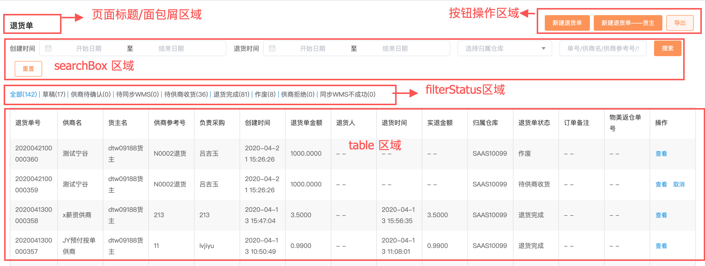
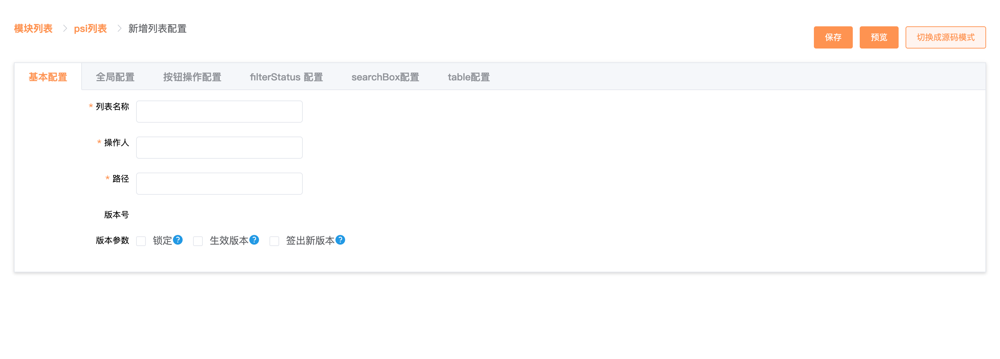
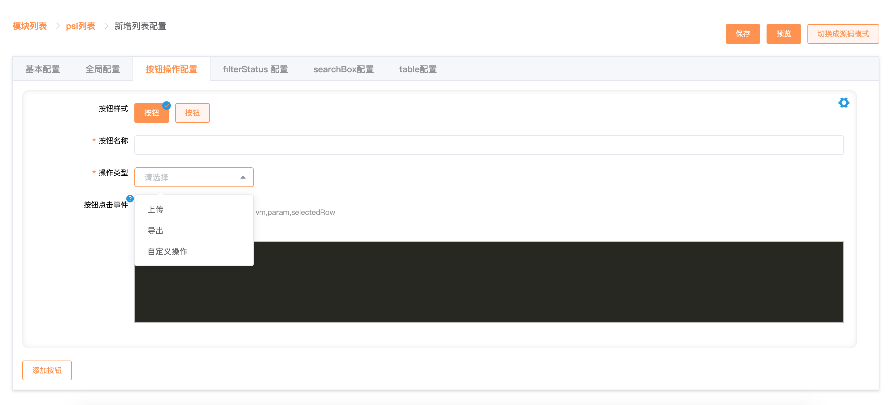
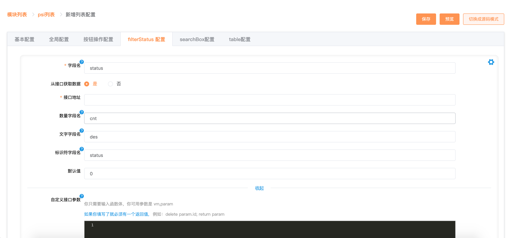
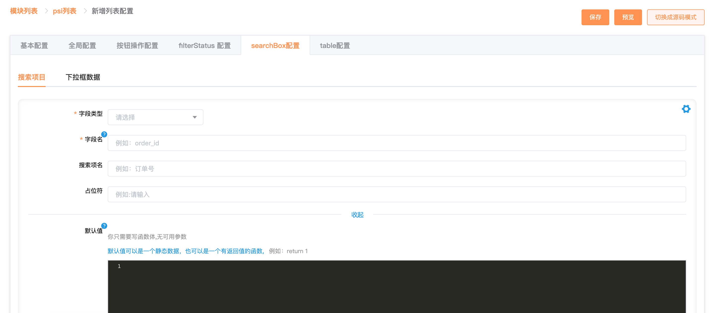
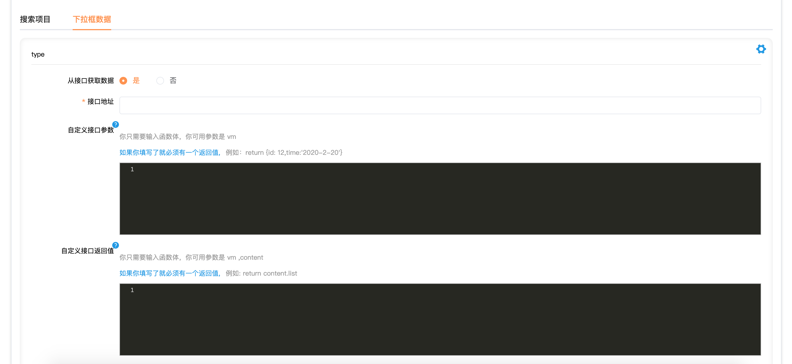
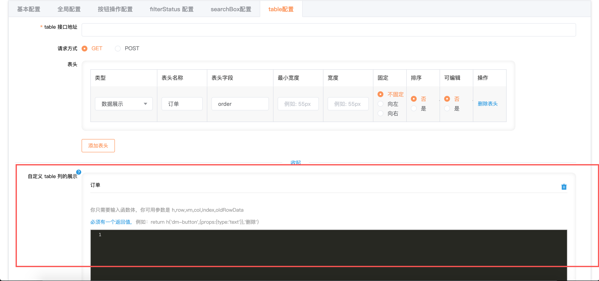

# 列表可视化创建入口

在 [http://saas-test.dmallmax.com/saasfe-cms-single/#/saasfe/cms/tableListConfig/modules](http://saas-test.dmallmax.com/saasfe-cms-single/#/saasfe/cms/tableListConfig/modules)中创建模块，已有的模块有 mis,mis-new,psi,wms,fin，然后在模块中创建页面


如上图所示是新建一个 psi 的列表页的入口，访问地址[点这里](http://saas-test.dmallmax.com/saasfe-cms-single/#/saasfe/cms/tableListConfig/list?moduleId=9&moduleName=psi)

# 列表可视化创建纬度

将整个列表页分为多个区域，以区域为纬度进行配置列表，列表可配置区域有：页面标题/面包屑，按钮操作，filterStatus,searchBox,表格



# 列表可视化创建适用范围

1. 重展示轻逻辑的列表页
2. 对于列表中有弹窗操作的页面，只适用提示类弹窗和只有一个输入框的弹窗。[支持的弹窗参考 element-ui 中的 MessageBox 弹窗](https://element.eleme.cn/#/zh-CN/component/message-box)

# 在 [saas-测试环境](http://saas-test.dmallmax.com/) 中使用创建的列表

列表创建完成之后会生成一个页面 ID


如果这个页面需要作为 saas 中的一个菜单访问，通过页面 ID 组装成一个完整菜单数据，然后提供给`熊云川`，菜单数据如下：

```js
{
  name:菜单名
  path:'/saasfe/dmallmaxTable/页面ID',
  is_local:true
}
``` 

这个页面的访问路径就是 `'/saasfe/dmallmaxTable/页面ID'`

# 列表页上线

列表页的配置保存在 Node 层的数据库中，如果需要将列表页上线联系 `李昭君`

# 列表可视化创建规则

## 基本配置



基本配置中所有字段不会反映到列表的界面上，这些字段只是对当前配置的页面做一些标记，使这个列表页与其他的列表页区分开

* 列表名称：配置一个有意义的名字，这个字段会显示在系统下（如：psi）的列表中
* 路径：推荐的值为系统名+需求路径名(如：/psi/otherfns/salesgroup/list)，这个字段会显示在模块下（如：psi）的列表中
* 操作人：填写配置这个列表的人员姓名
* 版本：列表配置存在版本管理的概念，通过版本参数可以设置列表的生效版本

## 全局配置


在全局配置中配置的内容，会反映到列表界面上，***接口所属系统决定了列表页所有接口的域名***

## 按钮操作配置



如果列表中存在按钮操作区域，那么就需要在这里来进行配置，预置的按钮操作类型有：上传，下载。除了上传/下载，还能自定义操作，例如：页面跳转，弹窗操作等

### 上传/下载


对于上传/下载操作按钮，必须填写接口地址，接口地址不需要填写域名，在程序中会根据在全局配置中设置的接口所属系统计算出域名

回调函数：回调函数表示上传/下载操作完成之后需要执行的函数。在配置的时候只需要写函数体的内容，在函数体可以使用的参数是 vm，vm 是列表页对应的 vue 组件实例，如果在上传/下载之后需要弹出一个提示窗，那么可以在回调函数中写如下代码：

```js
  vm.$alert('上传完成', '提示', {
    confirmButtonText: '确定'
  });
```

自定义接口参数：默认会将 searchBox 区域,filterStatus 区域, 表格区域的分页数据全部传递到下载接口。如果需要对参数进行修改，你可以自定接口的参数。在配置的时候只需要写函数体的内容，并且必须有一个返回值，在程序中会将返回值当做下载接口的参数，在函数体可以使用的参数是 vm,param，vm 是列表页对应的 vue 组件实例,param 是 searchBox 区域,filterStatus 区域和表格区域的分页数据的集合。如果你需要删除分页数据，代码如下：

```js
delete param.pn;
delete param.rn;

return param;
```

### 自定义按钮操作


对于自定义操作的按钮，必须填写按钮的点击事件对应的操作，只需要写函数体，在函数体中可以使用的参数是 vm,param,selectedRow，vm 是列表页对应的 vue 组件实例,param 是 searchBox 区域,filterStatus 区域和表格区域的分页数据的集合，selectedRow 是 table 中勾选的数据行。

直接请求接口，代码如下：

```js
//  得到完整的接口地址
const fullUrl = vm.$getFullUrl('PSI','/xxx/xxxx')
delete param.rn;
delete param.pn;

vm.$post(fullUrl,param).then(() => {
  vm.$message.success('操作成功')
  
  // 重新获取列表数据
  vm.$updateList();
})

```

跳转到一个新页面,代码如下：

```js
// 稍后介绍 vm.navTo 方法
vm.navTo(vm,{
  ...
  query:{},
  param:{}
})
```

弹出一个提示框再请求接口

```js
this.$alert(`你选中了${selectedRow.length}条数据，确认创建？`, '提示', {
  confirmButtonText: '确定',
  callback: action => {
    if(action === 'confirm') {
      const fullUrl = vm.$getFullUrl('PSI','/xxx/xxxx')
      
      vm.$post(fullUrl,{
        ids:JSON.stringify(selectedRow.map(row => row.id))
      }).then(() => {
        vm.$message.success('操作成功')
        
         // 重新获取列表数据
          vm.$updateList();
      })
    }
  }
});
```

弹出内容输入框再请求接口

```js
vm.$prompt('请输入数量', '提示', {
  confirmButtonText: '确定',
  cancelButtonText: '取消',
  inputPattern: /^\d+$/g,
  inputErrorMessage: '格式不正确'
}).then(({value}) => {
    const fullUrl = vm.$getFullUrl('PSI','/xxx/xxxx');
    vm.$post(fullUrl,{
      value:value
    }).then(() => {
      vm.$message.success('操作成功')
      
       // 重新获取列表数据
        vm.$updateList();
    })
})
```

## filterStatus 配置



如果在列表中存在 filterStatus 区域，就在这个区域中进行配置

filterStatus 区域展示的数据可以从接口中得到也可以是一个固定的值，它可以是数组也可以是对象，在这里介绍从接口中获取数据的情况

字段名：它对应的值会作为 table 区域接口和按钮操作接口的参数名

接口地址：获取 filterStatus 区域数据的接口地址，在这里不需要填写域名，在程序中会根据在全局配置中设置的接口所属系统计算出域名

数量字段名：filterStatus 区域数据中表示数量的字段

文字字段名：filterStatus 区域数据中表示文字的字段

标识符字段名：在请求列表接口，按钮操作接口时将标识符字段对应的值当前参数值

默认值：filterStatus 区域选中的默认值

自定义接口参数：当从接口中获取 filterStatus 区域数据时，默认会将 searchBox 区域的全部参数传递到接口，也支持自定义接口参数，在自定义接口参数时，只需写函数体并且必须有一个返回值，***程序中会将这个返回值当做接口的参数***，在函数体中可以使用的参数有 vm,param。vm 是列表页对应的 vue 组件实例,param 是 searchBox 区域的参数，如果需要修改默认参数，代码如下

```js
param.time = Number(new Date().getTime() / 1000)

return param
```

自定义 statusFilter 数据：当从接口中获取 filterStatus 区域数据时，默认会将接口返回的 content 字段作为 filterStatus 区域数据，如果接口返回的 content 不满足数据展示要求，也支持自定义数据。在自定义数据时，只需写函数体并且必须有一个返回值，程序会将这个返回值当前 filterStatus 区域的数据，在函数体中可用的参数是 vm,content。vm 是列表页对应的 vue 组件实例，content 是接口返回的 content 字段。如果需要修改接口返回的 content，代码如下：

```js
return content.list
```

## searchBox 配置



在 searchBox 配置区域可以配置任意多个 search 项目。可选的类型有：单行输入框，批量输入框，下拉框，级联选择器，日期选择器，日期时间选择，日期范围选择器，日期时间范围选择器。

字段名：不论是哪种类型，字段名都是必填的，字段名会做为 table 区域，filterStatus区域，按钮操作的参数名。

默认值：默认值可以是一个函数也可以是一个固定的值，***推荐使用函数***，当包含 return 就会认为默认值是一个函数，只需要写函数体并且没有可用参数

```js
// 设置默认值

// 函数类型
return new Date().getTime()/1000

// 固定值
1
```

### 单行输入框

单行输入框类型的搜索项配置比较简单，在这个不加以说明

### 批量输入框

批量输入框搜索的结果是一个数组，在传递在接口之前可能需要配置人员自行处理参数值

### 日期选择器，日期时间选择器

日期选择器，日期时间选择器的搜索项配置比较简单，在这个不加以说明

### 日期范围选择器，日期时间范围选择器

字段名具有解构的能力，如果日期范围和日期时间范围选择器的值需要保存在两个不同的变量中，字段名可以使用如下的方式

```js
[start_time,end_time]
```

### 下拉框选择器

对于下拉框而言，需要配置下拉框数据，下拉框数据可以是对象也可以是数组。如何获取下拉框数据稍后介绍

```js
// 这是下拉框的数据

[
  {
    type_key:'1',
    type_name:'司机'
  },
  {
    type_key:'2',
    type_name:'供商'
  }
]

// 如果下拉框的数据如上，那么就需要设置下拉框的显示配置，如下所示：

{key:'type_key',label:'type_name'}
```

```js
// 这是下拉框的数据

{
  1:'司机',
  2:'供商'
}

// 如果下拉框的数据如上，那么就不需要设置下拉框的显示配置
```

### 级联选择器

对于级联选择器而言，需要配置级联选择器下拉数据。如何获取级联选择器下拉数据稍后介绍

级联选择器的下拉数据格式同 [element-ui 中 cascader 组件的 options 参数](https://element.eleme.cn/#/zh-CN/component/cascader)，支持二级联动，三级联动，n 级联动。

级联选择器的显示配置同 [element-ui 中 cascader 组件的 props 参数](https://element.eleme.cn/#/zh-CN/component/cascader)

字段名具有解构的能力，如果级联选择器选择的值需要保存在多个不同的变量中，以二级联动为例字段名可以使用如下的方式

```js
[first_level,second_level]
```

### 从接口中获取下拉框和级联选择的下拉数据



接口地址不需要写域名，程序会根据在全局配置中配置的接口所属系统生成接口域名

在从接口中获取下拉数据，你可以设置接口的参数，在设置接口参数的时你只需要写函数体，并且必须要有一个返回值，程序会将这个返回值当做接口的参数，在函数体你能够使用的参数是 vm,vm 是列表页对应的 vue 组件实例。如下自定义下拉框数据接口的参数：

```js
return {
  time:new Date().getTime()/1000,
  type:1
}
```
从接口中获取下拉数据时，如果接口返回的 content 字段不符合下拉框数据的展示要求，你可以需要根据 content 字段自定义下拉框数据，在自定义下拉框数据时你只需要写函数体，并且必须有一个返回值，程序会将这个返回值当做的下拉框数据，在函数体中你能够使用的参数是 vm,content。vm 是列表页对应的 vue 组件实例，content 是接口返回的 content 字段。如下自定义下拉框数据：

```js
return content.list
```
> 如果需要从一个接口得到多个下拉数据，在选择下拉数据字段时，你需要选择 _ALL_,并且需要自定义各个下拉数据的数据。


```js
// 自定义各个下拉数据的数据

return {
  type:content.user_type,
  one:content.other
}
```

> 通过 _ALL_ 设置各个下拉数据的优先级低于单独设置下拉数据。换句话说，如上的例子，如果你单独设置了字段名为 type 的下拉数据，同时也通过 _ALL_ 设置字段名为 type 的下拉数据，程序会采用单独设置的下拉数据

### 不从接口中获取下拉框和级联选择的下拉数据


如果不从接口获取下拉数据，你就需要自己去计算下拉数据，在计算下拉数据时，你只需要写函数体，并且必须有一个返回值，程序会将这个返回值当做下拉数据。在函数体中能够使用的参数有 vm,vm 是列表页对应的 vue 组件实例，如下是设置下拉数据：

```js
return localStorage.getItem("user_list")
```

## table 配置


table 接口地址不需要写域名，程序会根据在全局配置中配置的接口所属系统生成接口域名

在表头配置中表头的字段支持按照路径取值，例如 user.name

在展示 table 每一列的内容时，默认将表头字段对应的文本内容展示出来，你也可以改变这一默认行为，对于操作列，你必须去自定义这列的展示内容，当确定要去自定义列的展示内容，你需要确保你对 [Vue 的渲染函数有所了解](https://cn.vuejs.org/v2/guide/render-function.html)



在自定义列的展示内容时，你只需要写函数体，并且必须有返回值，程序会根据返回值去渲染展示内容，在函数体中你可以使用的参数是 h,row,vm,col,index,oldRowData。h 是  Vue 的 createElement 方法，row 是 table 的行数据，vm 是列表页对应的 vue 组件实例，col 是列数据，index 是列的下标，oldRowData 是 table 的行数据 ，在可编辑 table 中，oldRowData 在取消编辑时会非常有用，你需要借助 oldRowData 将 table 中展示数据恢复成编辑之前的状态。自定列的展示内容如下：

```js
const btnGroup = []
// 设置一个删除按钮
btnGroup.push(
  h('dm-button',{
    props:{type:'text'},
    on:{
      click:(event) => {
        // 得到完整的接口地址
        const fullUrl = vm.$getFullUrl('PSI','/xx/xxx/xxx')
        
        vm.$post(fullUrl,{
          id:row.id
        }).then(() => {
          vm.$message.success('删除成功')
          
          // 刷新列表
          vm.$updateList()
        })
        
      }
    }
  },'删除')
)

// 设置跳转按钮

btnGroup.push(
  h('dm-button',{
    props:{type:'text'},
    on:{
      click:(event) => {
        // 稍后介绍 vm.navTo 方法
        vm.navTo(vm,{
          ...,
          query:{
            id:row.id
          },
          param:{}
        })
      }
    }
  },'查看详情')
)

return h('div',btnGroup)
```

自定义 table 接口参数：在请求 table 数据接口时，默认会将 filterStatus 区域，searchBox 区域以及分页器选择的数据作为接口的参数，你也可以改变这默认行为。在自定义 table  接口参数时，你只需要写函数体，并且必须有一个返回值，程序会将这个返回值当做 table 接口的参数。在函数体中你可以使用的参数有 vm, param, vm 是列表页对应的 vue 组件实例,param 是 filterStatus 区域，searchBox 区域以及分页器选择的数据集合。如下是修改接口参数的例子：

```js
param.batchInput = param.batchInput.join(',')
return param
```

自定义 table 数据：默认情况会将 table 接口返回的 content 字段作为界面上 table 区域的数据，content 必须是 `{list:[...],total:xx}`格式。如果接口返回的 content 不满足数据格式要求，你可以借助接口返回的 content 计算出最终的 table 数据。在计算 table 数据时，你只需要写函数体，并且必须有一个返回值，程序会将这个返回值当做 table 区域的数据。在函数体中能够使用的参数 vm,content,vm 是列表页对应的 vue 组件实例,content 是接口返回的 content 字段。如下是根据接口返回的 content 字段计算出 table 区域的例子：

```js
return {
  list:content.table_list,
  total:content.total
}
```

# vm支持的方法

* vm.navTo

通过 vm.navTo 实现页面直接的跳转，vm.navTo 接受两个参数，第一个参数是 vm,第二个参数是一个表示跳转位置的对象。第二个参数的属性如下：

|属性名|描述|必填|类型|
|----|----|----|----|
|belong|目标页所属系统。关于这个字段的具体取值，可以参考 `/account/menu/get` 接口返回的 list 字段中目标页的 belong 字段|否|字符串|
|is_local|关于这个字段的具体取值，可以参考 `/account/menu/get` 接口返回的 list 字段中目标页的 is_local 字段|否|布尔值|
|path|目标页的路径，关于这个字段的具体取值，可以参考 `/account/menu/get` 接口返回的 list 字段中目标页的 path 字段|是|字符串|
|query|目标页的查询参数|否|对象|
|param|其他参数|否|对象|

```js
vm.navTo(vm,{
  belong:'MIS',
  path:'/order/user/detail',
  query:{
    id:'xxxx'
  },
  param:{
    // 是否固定左侧菜单和顶部菜单的选中状态
    menuFixed:true,
    // 是否记住列表页 searchBox ，filterStatus，分页器的参数。如果记住参数，在返回列表的时候能够直接用记住的参数请求 table 接口
    keepQuery:true
  }
})
```

* vm.$fetch：get 请求的方法，它接受两个参数，第一个参数表示接口地址，第二个参数表示接口参数

```js
vm.$fetch(url,{
  id:'xxx',
  ...
}).then(res => {
  const content = res.content;
})
```

* vm.$post：post 请求的方法，它接受两个参数，第一个参数表示接口地址，第二个参数表示接口参数

```js
vm.$post(url,{
  id:'xxx',
  ...
}).then(res => {
  const content = res.content;
})
```

* vm.$del: del 请求的方法，它接受两个参数，第一个参数表示接口地址，第二个参数表示接口参数

```js
vm.$del(url,{
  id:'xxx',
  ...
}).then(res => {
  const content = res.content;
})
```

* vm.$formatDate: 将时间戳格式化成时间字符串。它接受两个参数，第一个参数表示时间戳，第二个参数表示时间字符串类型,第二个参数非必填

第二个参数的可选值

|值|对应的时间字符串类型|
|----|----|
|datetime|year - month - date  hour : minute : second|
|date|year - month - date|

* vm.$loading：显示 loading 效果。具体使用见 [element-ui 的 Loading](https://element.eleme.cn/#/zh-CN/component/loading)

```js
const loading = vm.$loading({
    lock: true,
    text: 'Loading',
    spinner: 'el-icon-loading',
    background: 'rgba(0, 0, 0, 0.7)'
})
setTimeout(() => {
// 关闭 loading
loading.close()
},1000)
```

* vm.$message：消息提示。具体使用见 [element-ui 的 message](https://element.eleme.cn/#/zh-CN/component/message)

```js
vm.$message.success('恭喜你，这是一条成功消息')
vm.$message.error('这是一条错误消息')
vm.$message.warning('警告哦，这是一条警告消息')
```

* vm.$alert: 消息提示。具体使用见 [element-ui 的 MessageBox 弹窗](https://element.eleme.cn/#/zh-CN/component/message-box)

```js
vm.$alert('这是一段内容', '标题名称', {
  confirmButtonText: '确定',
  callback: action => {
    vm.$message({
      type: 'info',
      message: `action: ${ action }`
    });
  }
});
```

* vm.$confirm:确认消息。具体使用见 [element-ui 的 MessageBox 弹窗](https://element.eleme.cn/#/zh-CN/component/message-box)

```js
vm.$confirm('此操作将永久删除该文件, 是否继续?', '提示', {
  confirmButtonText: '确定',
  cancelButtonText: '取消',
  type: 'warning'
}).then(() => {
  vm.$message.success('删除成功!')
}).catch(() => {
  vm.$message('已取消删除')        
});
```

* this.$prompt：提交信息。具体使用见 [element-ui 的 MessageBox 弹窗](https://element.eleme.cn/#/zh-CN/component/message-box)

```js
    vm.$prompt('请输入邮箱', '提示', {
      confirmButtonText: '确定',
      cancelButtonText: '取消',
      inputPattern: /[\w!#$%&'*+/=?^_`{|}~-]+(?:\.[\w!#$%&'*+/=?^_`{|}~-]+)*@(?:[\w](?:[\w-]*[\w])?\.)+[\w](?:[\w-]*[\w])?/,
      inputErrorMessage: '邮箱格式不正确'
    }).then(({ value }) => {
      vm.$message({
        type: 'success',
        message: '你的邮箱是: ' + value
      });
    }).catch(() => {
      vm.$message({
        type: 'info',
        message: '取消输入'
      });       
    });
```

* vm.$updateList:刷新列表。无参数

```js
vm.$updateList()
```

* vm.filterStatusInfo: filterStatus 区域的数据

* vm.selectInfo : searchBox 区域的数据

