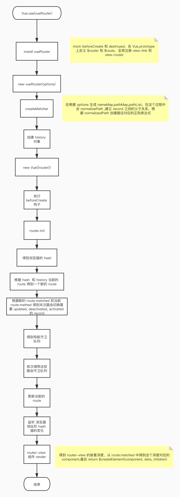

# vue-router 源码解读

## vue.use(VueRouter)

VueRouter 作为 Vue 的一个插件，是通过 vue.use(VueRouter) 进行注册，调用 vue.use(VueRouter) 会给每个组件 mixin 两个钩子函数，分别是 beforeCreate 和 destroyed，并且在 vue.use(VueRouter) 时也会在 Vue.prototype 上定义 $router 和 $route，全局注册 RouterView 和 RouterLink。

```js
Vue.mixin({
    beforeCreate () {
      if (isDef(this.$options.router)) {
        this._routerRoot = this
        this._router = this.$options.router
        this._router.init(this)
        Vue.util.defineReactive(this, '_route', this._router.history.current)
      } else {
        this._routerRoot = (this.$parent && this.$parent._routerRoot) || this
      }
      registerInstance(this, this)
    },
    destroyed () {
      registerInstance(this)
    }
  })

  Object.defineProperty(Vue.prototype, '$router', {
    get () { return this._routerRoot._router }
  })

  Object.defineProperty(Vue.prototype, '$route', {
    get () { return this._routerRoot._route }
  })

  Vue.component('RouterView', View)
  Vue.component('RouterLink', Link)
```

## matcher

在 VueRouter 的构造函数中会创建 matcher,由于 routes 是一个树状结构的数组，所有在创建 matcher 的过程中会递归遍历所有的 routes 和 routes.children，最终生成 nameMap，pathMap，pathList。VueRouter 中使用 path-to-regexp 将路径转成正则表达式

### 为什么嵌套路由的子路径的 path 可以不用 `/` 开头

因为在生成 matcher 时，在递归遍历的过程中，如果 child.path 不是以 `/` 开头，就会将 child.path 改成 parent.path + '/' + child.path

```js
function normalizePath (
  path: string,
  parent?: RouteRecord,
  strict?: boolean
): string {
  if (!strict) path = path.replace(/\/$/, '')
  if (path[0] === '/') return path
  if (parent == null) return path
  return cleanPath(`${parent.path}/${path}`)
}
```

##  路由切换

在 VueRouter 中有 location 的概念，在切换路由时会根据传入的 location 和当前的 route 计算出一个新的 route ,然后准备导航到这个新的 route，在导航到新的 route 之前，会计算出经过这次路由切换会让哪些路由记录 updated, deactivated, activated。然后得到这些路由的各个路由守卫，以队列的形式依次执行这些路由守卫，这也是为什么要在路由守卫中执行 next 方法的原因，执行 next 访问意味着从路由守卫队列中取出下一个路由守卫并执行它。

```js
    // 得到 updated, deactivated, activated 的路由记录
const { updated, deactivated, activated } = resolveQueue(
      this.current.matched,
      route.matched
    )
    
    // 路由守卫队列
    const queue: Array<?NavigationGuard> = [].concat(
          // in-component leave guards
          extractLeaveGuards(deactivated),
          // global before hooks
          this.router.beforeHooks,
          // in-component update hooks
          extractUpdateHooks(updated),
          // in-config enter guards
          activated.map(m => m.beforeEnter),
          // async components
          resolveAsyncComponents(activated)
        )
        // 执行路由守卫
         const iterator = (hook: NavigationGuard, next) => {
              if (this.pending !== route) {
                return abort()
              }
              try {
                hook(route, current, (to: any) => {
                  if (to === false || isError(to)) {
                    // next(false) -> abort navigation, ensure current URL
                    this.ensureURL(true)
                    abort(to)
                  } else if (
                    typeof to === 'string' ||
                    (typeof to === 'object' &&
                      (typeof to.path === 'string' || typeof to.name === 'string'))
                  ) {
                    // next('/') or next({ path: '/' }) -> redirect
                    abort()
                    if (typeof to === 'object' && to.replace) {
                      this.replace(to)
                    } else {
                      this.push(to)
                    }
                  } else {
                    // confirm transition and pass on the value
                    next(to)
                  }
                })
              } catch (e) {
                abort(e)
              }
            }
            
            
            

// 依次取出路由守卫            
 function runQueue (queue: Array<?NavigationGuard>, fn: Function, cb: Function) {
  const step = index => {
    if (index >= queue.length) {
      cb()
    } else {
      if (queue[index]) {
        fn(queue[index], () => {
          step(index + 1)
        })
      } else {
        step(index + 1)
      }
    }
  }
  step(0)
}

// 运行队列
runQueue(queue, iterator, () => {
      const postEnterCbs = []
      const isValid = () => this.current === route
      // wait until async components are resolved before
      // extracting in-component enter guards
      const enterGuards = extractEnterGuards(activated, postEnterCbs, isValid)
      const queue = enterGuards.concat(this.router.resolveHooks)
      runQueue(queue, iterator, () => {
        if (this.pending !== route) {
          return abort()
        }
        this.pending = null
        onComplete(route)
        if (this.router.app) {
          this.router.app.$nextTick(() => {
            postEnterCbs.forEach(cb => {
              cb()
            })
          })
        }
      })
})
```

在根据新的 route.matched 和当前 route.matched 得到经过本次切换需要 updated, deactivated, activated 的路由记录，然后得到这些路由记录的需要执行的路由守卫，这些路由守卫会被包裹到一个包裹函数中，上述代码中的 hook 就是包裹函数，VueRouter 会在包裹函数中调用项目中定义的路由守卫，通过这种方式实现给路由守卫绑定上下文，也通过这种方式使得组件内部的 beforeRouteEnter 守卫的第三个参数 next 可以传递一个回调函数，在这个回调函数被调用的时候能够给它传当前组件的实例作为参数

## 浏览器地址栏 url


> 只讨论 hash 模式，并且浏览器不支持 pushState 的情况

在 VueRouter 中 history 对象，history 提供了一些路由切换方法(比如：push,replace 等) ，改变浏览器地址栏 url 的方法以及给 window 绑定 hashchange 事件。

```js
switch (mode) {
      case 'history':
        this.history = new HTML5History(this, options.base)
        break
      case 'hash':
        this.history = new HashHistory(this, options.base, this.fallback)
        break
      case 'abstract':
        this.history = new AbstractHistory(this, options.base)
        break
      default:
        if (process.env.NODE_ENV !== 'production') {
          assert(false, `invalid mode: ${mode}`)
        }
    }
```

### 确保浏览器地址栏 url 带 `#`

```js
function ensureSlash (): boolean {
  const path = getHash()
  if (path.charAt(0) === '/') {
    return true
  }
  replaceHash('/' + path)
  return false
}
```
在 new VueRouter() 就会生成 history 对象。并且 history 的构造函数中会执行 ensureSlash ，这个方法用来确保浏览器地址栏中有一个 `#` ，这也是为什么在打开一个页面没有带 `#` ，浏览器地址栏会替换成带 `#` 的原因.例如：

```
 http://www.xxx.com/ => http://www.xxx.com/#/
```

### 监听浏览器地址栏 hash 的变化

```js
setupListeners () {
    const router = this.router
    const expectScroll = router.options.scrollBehavior
    const supportsScroll = supportsPushState && expectScroll

    if (supportsScroll) {
      setupScroll()
    }

    window.addEventListener(
      supportsPushState ? 'popstate' : 'hashchange',
      () => {
        const current = this.current
        if (!ensureSlash()) {
          return
        }
        this.transitionTo(getHash(), route => {
          if (supportsScroll) {
            handleScroll(this.router, route, current, true)
          }
          if (!supportsPushState) {
            replaceHash(route.fullPath)
          }
        })
      }
    )
  }
```

在 router.init 中会有一次路由切换，在路由切换之后会 调用 setupListeners 方法去监听浏览器地址栏 hash 的变化

## router-view

router-view 可以嵌套，routes 也是可以嵌套的，router-view 的嵌套和 routes 的嵌套是对应的，利于这一规则，就可以根据 router-view 的嵌套深度，在 route.matched 上得到这个 router-view 对应的 component

router-view 的 render 简化版本
```js
 render (_, { props, children, parent, data }) {
    // used by devtools to display a router-view badge
    data.routerView = true

    // directly use parent context's createElement() function
    // so that components rendered by router-view can resolve named slots
    const h = parent.$createElement
    const name = props.name
    const route = parent.$route
    const cache = parent._routerViewCache || (parent._routerViewCache = {})

    // determine current view depth, also check to see if the tree
    // has been toggled inactive but kept-alive.
    let depth = 0
    let inactive = false
    while (parent && parent._routerRoot !== parent) {
      const vnodeData = parent.$vnode ? parent.$vnode.data : {}
      if (vnodeData.routerView) {
        depth++
      }
      if (vnodeData.keepAlive && parent._directInactive && parent._inactive) {
        inactive = true
      }
      parent = parent.$parent
    }
    data.routerViewDepth = depth

   //...something

    const matched = route.matched[depth]
    const component = matched && matched.components[name]

   //...something

    return h(component, data, children)
  }
``` 

render 中的 parent 是 view-router 的父组件，render 中的 data 是通过 view-router 渲染出的组件的 data，给 data 设置 routerView 为 true，在 while 循环时就可以得到嵌套深度。

### 为什么浏览器地址栏上的路径变化之后，视图也会对应变化？

调用 vue.use(VueRouter) 会给组件 mixin beforeCreate 构造函数，在 beforeCreate 会将 _route 定义成响应式的。并且 Vue.prototype.$route 引用的就是 _route,在 view-router 的 render 中访问了 $route,所以只要 _route 的值发生变化，view-router 的 render 就会重新渲染。

```js
Object.defineProperty(Vue.prototype, '$route', {
    get () { return this._routerRoot._route }
  })
```

在路由切换完之后会修改 _route 的值

```js
history.listen(route => {
  this.apps.forEach((app) => {
    app._route = route
  })
})
    
history.listen (cb: Function) {
    this.cb = cb
}

updateRoute (route: Route) {
    const prev = this.current
    this.current = route
    // 修改 app._route，使 router-view 重新执行 render 
    this.cb && this.cb(route)
    this.router.afterHooks.forEach(hook => {
      hook && hook(route, prev)
    })
  }
```

## 从 Vue.use(vueRouter) 到切换到浏览器地址栏的 hash 值对应路由的流程图


