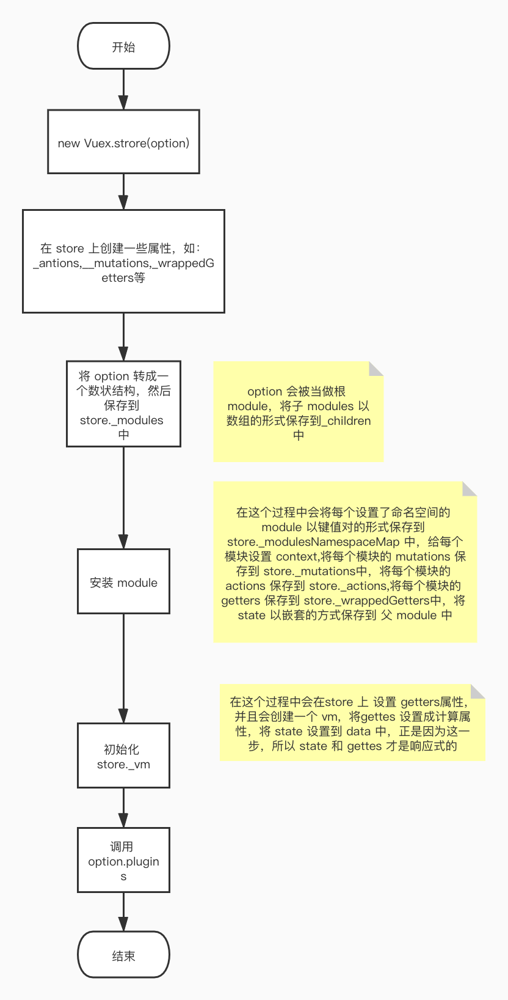

# vuex 源码解读

## vuex 安装

```js
Vue.use(vuex)
```

在调用`Vue.use(vuex)`安装 vuex 时会将 vuex 初始化方法与 beforeCreate 钩子绑定混入到 Vue 钩子函数上

```js
 Vue.mixin({ beforeCreate: vuexInit })
```

```js
function vuexInit () {
    const options = this.$options
    // store injection
    if (options.store) {
      this.$store = typeof options.store === 'function'
        ? options.store()
        : options.store
    } else if (options.parent && options.parent.$store) {
      this.$store = options.parent.$store
    }
  }
```

在任何 vm beforeCreate 时都会调用 `vuexInit`，所以在任何组件中都可以通过 `this.$store` 访问到 store

## new Vuex.store (option) 流程图



## modules

在 new Vuex.store(option) 时递归 option 中的所有 module，最终生成一个树状结构，new Vuex.store 的参数会被当做 root module

modules 最终会变成如下结构

```
{
  _children:{...},
  _rawModule:{...},
  state,
  ...
}
```

## 安装 modules

安装 modules 时会将根据当前模块是否有命名空间，将这个模块的 mutation,action,getter,state 以模块名加上 type 作为键保存到 store 中的属性中,state 的访问路径与其他的访问路径有所不同

例如：

```
{
  _actions:{
    increament:[(...){...}],
    a/increament:[(...){...}],
  },
  _mutations:{
    count:[(...){...}],
    a/count:[(...){...}],
  },
  _wrappedGetters:{
    total(...){...},
    a/total(...){...}
  },
  state:{
    num:xxx,
    a:{
        num:xxx
    }
  }，
  _modulesNamespaceMap:{
    a/:module
  }
}
```

当做本模块中调用 commit,dispatch,getters,state 时不用带上一个完整的路径名，只需要有本模块中的 type，这是因为 vuex 会重写每个模块的 commit ,dispatch,getters,state API, 在模块内部调用 commit ,dispatch,getters,state 时会根据当前传入的 type，生成一个完整的路径。

例如：

```
// 在 a 模块中

{
  namespaced:true,
  state:{
    num:0
  },
  mutations:{
    count(state,num){...}
  },
  actions:{
    increament(context,payload){
        // 在这里只需要写本模块的 type  
        context.commit('count',payload)
    }
  }
}
```

## 让 getters 随着 state 的变化而变化

用 new Vue 生成一个 vm，将所有的模块中 getters 作为 vm 的计算属性，通过 Object.defineProperty 给 store.getters 定义访问描述符，如下：

```js
 forEachValue(wrappedGetters, (fn, key) => {
    // use computed to leverage its lazy-caching mechanism
    // direct inline function use will lead to closure preserving oldVm.
    // using partial to return function with only arguments preserved in closure environment.
    computed[key] = partial(fn, store)
    Object.defineProperty(store.getters, key, {
      get: () => store._vm[key],
      enumerable: true // for local getters
    })
  })
  
  
  store._vm = new Vue({
      data: {
        $$state: state
      },
      computed
    })
```

当访问 this.$store.getters.xxx 时会执行 get ,get 会返回 store._vm 中的计算属性，而store._vm 中的计算属性是通过 state 计算得到的，所有 this.$store.getters.xxx 的值会随着 state 的变化而变化，也正是因为这一步，所以 state 和 getter 才是响应式的

## store.state

因为 store 中所有的 state 被赋值到 vm 的 data 中，所以在访问 this.$store.state 时访问的是 vm 中 data 中的 state

```js
    ...
    get state(){
      return this._vm.$$state
    }
    ...
```

## store.commit

在调用 store.commit 时，会根据 type 从 store._mutations 中找到这个 type 对应 mutation 包裹方法，然后将 store._committing 设置为 true，然后执行 mutation 包裹方法 ，进而执行 mutation 方法。

```js
 const entry = this._mutations[type]
 this._withCommit(() => {
   // handler 是 mutation 包裹方法
       entry.forEach(function commitIterator (handler) {
         handler(payload)
       })
     })
```

## store.dispatch

在调用 store.dispatch 时，会根据 type 从 store._actions 中找到这个 type 对应 action 包裹方法，然后执行 action 包裹方法，进而执行 action 方法

```js
const entry = this._actions[type]

const result = entry.length > 1
      ? Promise.all(entry.map(handler => handler(payload)))
      : entry[0](payload)
      
```

## mapState

在代码中直接访问 store 或者 this.$store 取值 state 会不太优雅，如果要取某个有命名空间的模块中的 state 就更让人难受了。 vuex 提供了 mapState 来解决这个问题，在 mapState 中会根据传入的 namespace, 找到这个 namespace 对应的 module，然后从这个 module 的 context 中去取你需要的 state,每个 module 的 context 是在 new Store 安装 modules 阶段生成的

```js
const mapState = normalizeNamespace((namespace, states) => {
  const res = {}
  if (process.env.NODE_ENV !== 'production' && !isValidMap(states)) {
    console.error('[vuex] mapState: mapper parameter must be either an Array or an Object')
  }
  normalizeMap(states).forEach(({ key, val }) => {
    res[key] = function mappedState () {
      let state = this.$store.state
      let getters = this.$store.getters
      if (namespace) {
        const module = getModuleByNamespace(this.$store, 'mapState', namespace)
        if (!module) {
          return
        }
        state = module.context.state
        getters = module.context.getters
      }
      return typeof val === 'function'
        ? val.call(this, state, getters)
        : state[val]
    }
    // mark vuex getter for devtools
    res[key].vuex = true
  })
  return res
})
```
normalizeNamespace 和 normalizeMap 都是规范传给 mapState 的参数，getModuleByNamespace 根据 namespace 从 store._modulesNamespaceMap 中找到这个 namespace 对应的 module，然后从这个 module 的 context 中取得 state 和 getters

## mapGetters

```js
const mapGetters = normalizeNamespace((namespace, getters) => {
  const res = {}
  if (process.env.NODE_ENV !== 'production' && !isValidMap(getters)) {
    console.error('[vuex] mapGetters: mapper parameter must be either an Array or an Object')
  }
  normalizeMap(getters).forEach(({ key, val }) => {
    // The namespace has been mutated by normalizeNamespace
    val = namespace + val
    res[key] = function mappedGetter () {
      if (namespace && !getModuleByNamespace(this.$store, 'mapGetters', namespace)) {
        return
      }
      if (process.env.NODE_ENV !== 'production' && !(val in this.$store.getters)) {
        console.error(`[vuex] unknown getter: ${val}`)
        return
      }
      return this.$store.getters[val]
    }
    // mark vuex getter for devtools
    res[key].vuex = true
  })
  return res
})
```
mapGetters 和 mapState 的实现很多地方是相同的，他与 mapState 的不同点是取值方式不同，mapGetters 通过 namespace 和 一系列 getter 名，生成一个完成的 getter 路径，然后从 this.$store.getters 中取值。

## mapMutations 

在代码中通过 store.commit 或者 this.$store.commit 修改 state 显得不够优雅，当要修改一个带有命名控件的 state,就更让人难受了，因为需要写一个完整的路径。vuex 提供了 mapMutations 语法糖来解决这个问题，在调用 mapMutations 时，你可以传入命名空间和一系列 mutation type, mapMutations 会根据命名空间找到对应的 module, 然后调用这个 module 的 context 中的 commit 

```js
const mapMutations = normalizeNamespace((namespace, mutations) => {
  const res = {}
  if (process.env.NODE_ENV !== 'production' && !isValidMap(mutations)) {
    console.error('[vuex] mapMutations: mapper parameter must be either an Array or an Object')
  }
  normalizeMap(mutations).forEach(({ key, val }) => {
    res[key] = function mappedMutation (...args) {
      // Get the commit method from store
      let commit = this.$store.commit
      if (namespace) {
        const module = getModuleByNamespace(this.$store, 'mapMutations', namespace)
        if (!module) {
          return
        }
        commit = module.context.commit
      }
      return typeof val === 'function'
        ? val.apply(this, [commit].concat(args))
        : commit.apply(this.$store, [val].concat(args))
    }
  })
  return res
})
```

module.context.commit 是重写了 store.commit

## mapActions

```js
const mapActions = normalizeNamespace((namespace, actions) => {
  const res = {}
  if (process.env.NODE_ENV !== 'production' && !isValidMap(actions)) {
    console.error('[vuex] mapActions: mapper parameter must be either an Array or an Object')
  }
  normalizeMap(actions).forEach(({ key, val }) => {
    res[key] = function mappedAction (...args) {
      // get dispatch function from store
      let dispatch = this.$store.dispatch
      if (namespace) {
        const module = getModuleByNamespace(this.$store, 'mapActions', namespace)
        if (!module) {
          return
        }
        dispatch = module.context.dispatch
      }
      return typeof val === 'function'
        ? val.apply(this, [dispatch].concat(args))
        : dispatch.apply(this.$store, [val].concat(args))
    }
  })
  return res
})
```

mapActions 与 mapMutations 类似，只是 mapActions 调用的是 dispatch

