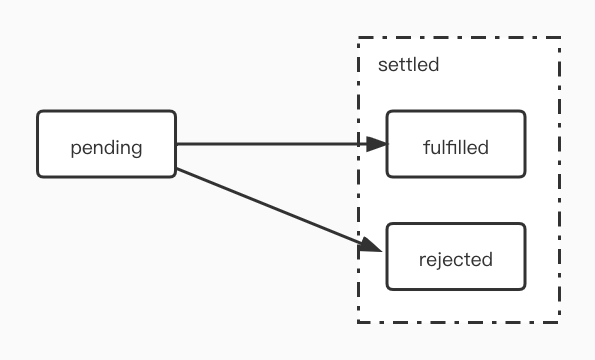
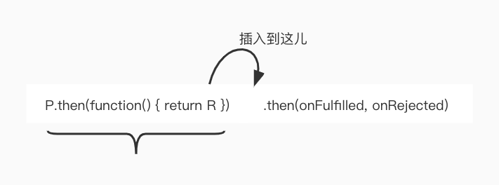

# Promise

为了方便后续的理解，首先先介绍一些与 Promise 相关的术语。

## 术语

### thenable 和 non-thenable

* thenable：有 then 方法的对象，也可以称为 PromiseLike。
* non-thenable：没有 then 方法的对象

### 状态

promise 有三种互斥的状态：

1. fulfilled：已经被兑现了。如果 promise 的状态变成 fulfilled，那么 promise.then(f) 中的 f 会被调用。
2. rejected：已经被拒绝了。如果 promise 的状态变成 rejected，那么 promise.then(undefined, r) 中的 r 会被调用。
3. pending：promise 的初始状态，promise 的状态既不是 fulfilled 也不是 rejected。

你可能会听到有人说某个 promise 已经被 settled 了，他的意思是这个 promise 不是 pending 状态，它是 fulfilled 或者 rejected 状态。settled 不是 promise 的状态，它只是语言上的便利。

promise 的状态一旦确定就不可变更，示意图如下：



通过下面的方式可以改变 promise 的状态，简化代码如下：

```javascript
const myPromise = new Promise((resolve, reject) => {
  //  在此之前 promise 的状态是 pending
  resolve(someValue)        // line A。promise 的状态会变成 fulfilled？maybe
  // or
  reject("failure reason")  // lineB。promise 的状态变成 rejected
});
```

你可能已经发现，lineA 比 lineB 的注释多了一个问号。调用 reject 一定会让 myPromise 的状态变成 rejected，但是调用 resolve 不一定会让 myPromise 的状态变成 fulfilled。那么调用 resolve 之后，myPromise 的状态会变成什么呢？这取决于 someValue 的类型。

* 如果 someValue 是一个 non-thenable，那么 myPromise 的状态会变成 fulfilled
* 如果 someValue 是一个 thenable 值，那么 myPromise 的状态会跟随 someValue 的状态

### 结果

promise 有两种互斥的结果：

1. resolved：已解决。如果一个 promise P 的状态跟随另一个 promise Q 的状态、P 的状态变成 fulfilled 或者 P 的状态变成 rejected，当出现这三种情况中的任意一种，那么就能认为 P 被 resolved。如何让 P 跟随 Q？在后面会详细介绍。
1. unresolved：未解决。

## Promise 构造函数

使用 Promise 构建函数是创建 promise 对象的常用方式。Promise 构造函数的接口如下：

```typescript
interface PromiseConstructor {
   
    new <T>(executor: (resolve: (value: T | PromiseLike<T>) => void, reject: (reason?: any) => void) => void): Promise<T>;
    
    // something
}
```

我们用 Promise 构建函数创建一个 promise 对象，记为 P。通过上面的 PromiseConstructor 接口，我们可以得出如下结论：

1. Promise 构建函数接受一个函数作为参数，在这里记为 executor，executor 没有返回值。即使你在代码中写了返回值，返回值也会被忽略。
2. executor 的参数 resolve 和 reject 依然是函数。
3. reject 接受任意类型作为参数，它会将 P 的状态变成 rejected。
4. resolve 的行为比 reject 的行为要复杂一些。如果 resolve 的参数的类型是 PromiseLike，例如是另一个 promise 对象，在这里记为 Q，那么 Q 会被动态插入到 promise 链中，这时 P 的状态会跟随 Q 的状态。如果 resolve 的参数的类型不是 PromiseLike，那么 P 的状态会变成 fulfilled。

补充：结合术语部分介绍的内容，我们总结一下。当调用 resolve 或者 reject 之后，我们可以说 P 被 `resolved`，但是我们不能说 P 的状态是 `settled`

分析下面这段代码，并在浏览器中运行它，看看你分析的结果与浏览器实际的结果是否一致

```javascript
function getMyPromise(p, finish = false) {
  return new Promise((resolve, reject) => {
    setTimeout(() => {
        if (finish) {
          resolve(p)
        } else {
          reject(p)
        }
    }, 1000)
  })
}

const myPromise1 = getMyPromise('我的状态会变成 rejected', false)
const myPromise2 = getMyPromise(myPromise1, true)

myPromise2.then((val) => {
    console.log(`我被兑现了，并且兑现的值是: ${val}`)
}).catch((error) => {
    console.log(`我被拒绝了, 理由是: "${error}"`)
})
```

浏览器打印的结果是：我被拒绝了, 理由是: "我的状态会变成 rejected"。从浏览器打印结果中可以看出：myPromise2 的状态跟随了 myPromise1 的状态，所以说，promise 的状态会变成 fulfilled 还是 rejected，这与调用 resolve 函数还是调用 reject 函数没有必然关系。

## promise 链

在本节中，我们将仔细研究 promise 是如何被链接的。比如，有下面这一行代码：

```javascript
const Q =  P.then(onFulfilled, onRejected)
```

Q 是一个新的 promise 对象，所以你能继续 Q.then(...)：

* Q 会被 P.then 中 onFulfilled 或 onRejected 的返回值 resolve。
* 如果 P.then 中的 onFulfilled 或 onRejected 抛出异常，Q 的状态会变成 rejected。

### 用 non-thenable 类型的值 resolve

这种方式比较简单，它指的是，在 onFulfilled 或 onRejected 中返回一个 non-thenable 类型的值，这个返回值可以在后续的 then 中获取到，Q 的状态会马上变成 fulfilled。

```javascript
P
.then(()=> {
    return '123'
})
.then((value) => {
    console.log(value); // 123
})
```

### 用 thenable 类型的值 resolve

在 onFulfilled 或 onRejected 中返回一个 thenable 类型的值，比如，在 onFulfilled 中返回 promise R，R 会被插入到 promise 链中。可以用这一特性来中断 promise 链。



利用这一特性，可以改写下面的代码

```javascript
asyncFunc1()
.then(function (value1) {
    asyncFunc2()
    .then(function (value2) {
        ···
    });
})
```

改写成：

```javascript
asyncFunc1()
.then(function (value1) {
    // 如果 asyncFunc2() 返回的 thenable 一直是 pending 状态，那么程序进不到下一个节点。 
    return asyncFunc2();
})
.then(function (value2) {
    ···
})
```

### 通过抛出异常的方式 reject

在 then 或 catch 中抛出的异常会被下一个错误处理器捕获。

```javascript
asyncFunc()
.then(function (value) {
    throw new Error();
})
.catch(function (reason) {
    // 在这里捕获异常
});
```

### promise 链与错误捕获

例如有下面两段代码：

```javascript
asyncFunc1()
.then(asyncFunc2)
.then(asyncFunc3)
.catch(function (reason) {
    // 捕获上面的错误
});
```

上面的代码使用 catch 捕获错误

```javascript
asyncFunc1()
.then(asyncFunc2)
.then(asyncFunc3, function (reason) {
    // 捕获上面的错误
})
```

上面的代码使用 then 的第二个参数 onRejected 捕获错误。

这两种捕获方式有什么差异呢？答案是，catch 能够捕获到 asyncFunc2 和 asyncFunc3 中发生的错误，onRejected 只能捕获到 asyncFunc2 发生的错误。我们改写第二段程序

```javascript
asyncFunc1()
.then(asyncFunc2)
.then(asyncFunc3)
.then(null, function (reason) {
    // Something went wrong above
})
```

现在 onRejected 可以捕获 asyncFunc2 和 asyncFunc3 中发生的错误。

总结：catch 和 then onRejected 都只能捕获它所在节点前面发生的错误。

## 使用 Promise 链的常见错误

### 错误一：丢失 promise 链的尾巴

错误的做法

```javascript
function foo() {
    const promise = asyncFunc();
    promise.then(result => {
        // 这里抛出的异常，在 foo().catch(...) 和 foo().then(null, onRejected) 中捕获不到
        ···
    });
    return promise;
}
```

正确的做法

```javascript
function foo() {
    return asyncFunc()
    .then(result => {
        ···
    });
}
```

### 错误二：promise 嵌套

不推荐的做法

```javascript
asyncFunc1()
.then(result1 => {
    asyncFunc2()
    .then(result2 => {
        ···
    });
});
```

推荐的做法

```javascript
asyncFunc1()
.then(result1 => {
  return asyncFunc2();
})
.then(result2 => {
    ···
});
```

### 错误三：创建新的 promise 对象而不使用已经存在的 promise 链

不推荐的做法

```javascript
function asyncFunc2() {
  return new Promise((resolve) => {
    asyncFunc1().then(resolve)
  })
}
```

推荐的做法

```javascript
function asyncFunc2() {
  return asyncFunc1()
}
```

## Promise 静态方法

### Promise.reject(reason)

Promise.reject 返回一个状态为 rejected 的 promise，并且被拒绝的原因为 reason.

```javascript
const myError = new Error('Problem!');
Promise.reject(myError)
.catch(err => console.log(err === myError)); // true
```

### Promise.resolve(value)

Promise.resolve 返回一个 promise 对象，在这里记为 P，使用 Promise.resolve 可以将任何类型的值转成 promise，至于返回的 P 是什么状态，这取决于 value 的类型，value 的类型可以分为三大类：

* 如果 value 是一个 non-thenable，那么 Promise.resolve 返回一个用 value 兑现的 P，P 的状态为 fulfilled

```javascript
Promise.resolve('123')
  .then(x => console.log(x)); // 123
```

* 如果 value 是一个 promise 对象，那么 Promise.resolve 返回的 P === value

```javascript
const p = new Promise(() => null);
console.log(Promise.resolve(p) === p); // true
```

* 如果 value 是一个 thenable ，那么 Promise.resolve 会用 value 生成 P，P 的状态与 value.then 的实现有关。

```javascript
const fulfilledThenable = {
      then(resolve) {
          resolve('hello');
      }
  };
  const promise = Promise.resolve(fulfilledThenable);
  console.log(promise instanceof Promise); // true
  promise.then(x => console.log(x)); // hello
```

再看一个例子

```javascript
const fulfilledThenable = {
      then(resolve, reject) {
          reject('reject hello'); // 注意这个地方
      }
  };
  const promise = Promise.resolve(fulfilledThenable);
  console.log(promise instanceof Promise); // true
  promise
    .then(x => console.log(x))
    .catch((reason) => console.log(reason)) // reject hello
```

### Promise.all(iterable)

Promise.all 接收一个可迭代对象作为参数，返回一个 promise 对象，在这里记为 P。如果 iterable 中存在数据项不是 promise，那么会用 Promise.resolve 将它转成 promise。当输入的 promise 全部变成 fulfilled 之后，P 会以输入的 promise 兑现的数组兑现。当任意一个输入的 promise 变成 rejected，P 会立即变成 rejected，并且 P 被拒绝的原因与首先变成 rejected 状态的 promise 被拒绝的原因相同。

```javascript
const promise1 = Promise.resolve(3);
const promise2 = 42;
const promise3 = new Promise((resolve, reject) => {
  setTimeout(resolve, 100, 'foo'); // 注意这里
});

Promise.all([promise1, promise2, promise3])
    .then((values) => {
      console.log(values); // [3, 42, "foo"]
    });
```

再看一个例子

```javascript
const promise1 = Promise.resolve(3);
const promise2 = 42;
const promise3 = new Promise((resolve, reject) => {
  setTimeout(reject, 100, 'foo'); // 注意这里
});

Promise.all([promise1, promise2, promise3])
.then((values) => {
  console.log(values);
})
.catch((reason) => {
    console.log(reason); // 'foo'
})
```

### Promise.allSettled(iterable)

Promise.allSettled 接收一个可迭代对象作为参数，返回一个 promise 对象，在这里记为 P。如果 iterable 中存在数据项不是 promise，那么会用 Promise.resolve 将它转成 promise。当输入的 promise 全部被 settled 之后，不论是 fulfilled 还是 rejected，P 的状态会变成 fulfilled。

```javascript
const promise1 = Promise.resolve(3);
const promise2 = new Promise((resolve, reject) => setTimeout(reject, 100, 'foo'));

Promise.allSettled([promise1, promise2])
    .then((results) => {
        results.forEach((result) => console.log(result.status))
});
// 输出
// "fulfilled"
// "rejected"
```

### Promise.any(iterable)

Promise.any 接收一个可迭代对象作为参数，返回一个 promise 对象，在这里记为 P。如果 iterable 中存在数据项不是 promise，那么会用 Promise.resolve 将它转成 promise。P 会以最先被兑现的 promise 的结果兑现，如果输入的所有 promise 都变成了 rejected，那么 P 会变成 rejected，并且被拒绝原因是 AggregateError 类型的对象。

```javascript
const promise1 = Promise.reject(0);
const promise2 = new Promise((resolve) => setTimeout(resolve, 100, 'quick'));
const promise3 = new Promise((resolve) => setTimeout(resolve, 500, 'slow'));


Promise.any([promise1, promise2, promise3]).then((value) => console.log(value)); // quick
```

再看一个例子

```javascript
const promise1 = Promise.reject(0);
const promise2 = new Promise((resolve, reject) => setTimeout(reject, 100, 'quick error'));
const promise3 = new Promise((resolve, reject) => setTimeout(reject, 500, 'slow error'));


Promise.any([promise1, promise2, promise3])
    .then((value) => console.log(value))
    .catch(reason => console.log(reason)) // AggregateError: All promises were rejected
```

### Promise.race(iterable)

Promise.race 接收一个可迭代对象作为参数，返回一个 promise 对象，在这里记为 P。如果 iterable 中存在数据项不是 promise，那么会用 Promise.resolve 将它转成 promise。P 的状态与最先变成 settled 的 promise 状态相同。

```javascript
const promise1 = new Promise((resolve, reject) => {
  setTimeout(resolve, 500, 'one');
});

const promise2 = new Promise((resolve, reject) => {
  setTimeout(resolve, 100, 'two');
});

Promise.race([promise1, promise2]).then((value) => {
  console.log(value); // two
});
```

再看一个例子

```javascript
const promise1 = new Promise((resolve, reject) => {
  setTimeout(resolve, 500, 'one');
});

const promise2 = new Promise((resolve, reject) => {
  setTimeout(reject, 100, 'two error');
});

Promise.race([promise1, promise2])
    .then((value) => {
      console.log(value); 
    })
    .catch(reason => {
        console.log(reason);  // two error
    })
```

## 例子

### 利用 promise 状态不可逆的特性实现请求超时

```javascript
function timeout(ms, promise) {
    return new Promise(function (resolve, reject) {
        promise.then(resolve);
        setTimeout(function () {
            reject(new Error('Timeout after '+ms+' ms')); // lineA
        }, ms);
    });
}
```

注意：在超时之后（line A），请求不会取消，但是 promise 不会再变成 fulfilled。

像下面这样使用 timeout()

```javascript
timeout(5000, httpGet('http://example.com/get/something'))
.then(function (value) {
    console.log('Contents: ' + value);
})
.catch(function (reason) {
    console.error('Error or timeout', reason);
});
```

### 使用 Promise.race() 实现请求超时

```javascript
function timeout(ms, promise) {
    function delay(ms) {
        return new Promise((resolve, reject) => {
            setTimeout(function () {
                reject(new Error('Timeout after '+ms+' ms')); // lineA
            }, ms);
        })    
    }

    return Promise.race([
        promise,
        delay(ms)
    ])
}
```
