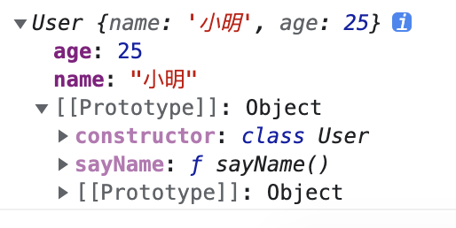
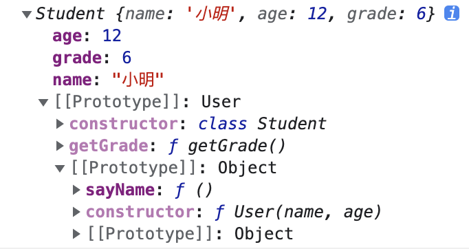

# class

在正式介绍 Javascript 中的 class 语法之前，我先提一个问题：Javascript 是一门面向对象编程的语言吗？你看了这一小节的标题，可能会觉得这是一个无意义的问题，但是请好好思考一下这个问题。

现在我来揭晓答案了，Javascript 是一门面向对象编程的语言。在维基百科上搜索 Object-oriented programming，可以得到下面一段描述：

Languages that support object-oriented programming (OOP) typically use inheritance for code reuse and extensibility in the form of either classes or prototypes.

上面这段话的意思是：支持面向对象编程的语言通常以类继承或原型继承的形式来实现代码重用和可扩展。

对于习惯使用 JavaScript 编程的工程师而言，当看到`原型`这两个字你一定会觉得很亲切。如果你现在还不清楚原型这一概念，也没有关系，在这一章我会简单的介绍一下原型。你要记住原型和原型链是 JavaScript 中很重要的知识点，你需要将它搞清楚。

在 ES6 规范发布之前，如果有人问一名使用 JavaScript 的前端工程师，JavaScript 是基于原型继承还是基于类继承？他很大几率会说，JavaScript 基于原型继承。这是因为在 ES6 规范发布之前，Javascript 没有与`类`相关的语法，class 语法被加入了 ES6 规范之后，JavaScript 才有了`类`这一概念。那么 class 语法是否将 JavaScript 从原型继承变成了类继承呢？下面我们来探讨一下。

## class 基本语法

在下面我定一个叫做 User 的类，User 中有两个成员变量，分别是：name 和 age，另外还有一个叫做 sayName 的成员方法。

```javascript
class User {
    name;
    age;
    
    constructor(name, age) {
        this.name = name;
        this.age = age;
    }

    sayName() {
        return this.name
    }
}

// 使用 User 类实例化出一个对象，赋值给 user1
const user1 = new User('小明', 25);
console.log(user1);
```

将上面的代码放在浏览器中执行，得到的结果如下图所示:



可以看到 user1 有 age 属性、 name 属性和 `[[Prototype]]` 属性，`[[Prototype]]`是一个 Object，sayName 方法位于 user1.`[[Prototype]]` 上，并且 `[[Prototype]]` 属性下也有一个名为 `[[Prototype]]` 的属性，它还是对象。

接下来我使用 ES6 规范之前的语法实现 User 类相同的功能，代码如下

```javascript
function User(name, age){
    this.name = name;
    this.age = age;
}

User.prototype.sayName = function() {
    return this.name;
}

// 使用 new 关键字调用 User 函数，并将结果赋值给变量 user2
var user2 = new User('小明', 25);
console.log(user2);
```

将上面的两段代码放在浏览器中执行，得到的结果如下图所示:


前面两张图得到的结果是类似的，都有 `[[Prototype]]` 属性，并且 use1 和 user2 的数据结构也差不多。

现在我将 class 语法与 prototype 语法放在一起使用，代码如下：

```javascript
function User(name, age){
    this.name = name;
    this.age = age;
}

User.prototype.sayName = function() {
    return this.name;
}

// Student 类继承自 User
class Student extends User{
    grade
    constructor(grade, name, age) {
        super(name, age);
        this.grade = grade;
    }

    getGrade() {
        return this.grade;
    }
}

const student = new Student(6, '小明', 12);
console.log(student);
```

在上面代码中我用到了 class 继承，现在先不用管它的语法，在后面的内容中我会详细介绍 class 继承的相关内容，现在先在浏览器中运行上述代码，看一下会不会报错，运行的结果如下：



这个例子让我们知道 class 语法与 prototype 语法可以放在一起使用。结合前面三段代码，我们可以得出一个结论：**class 语法没有将 JavaScript 从原型继承变成了类继承**。

## class 只是语法糖吗？

