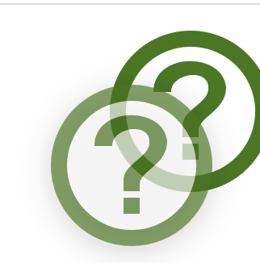
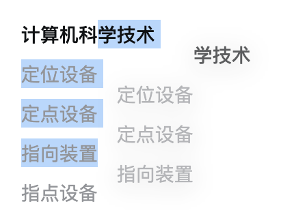
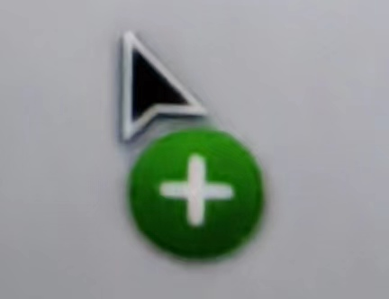
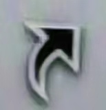
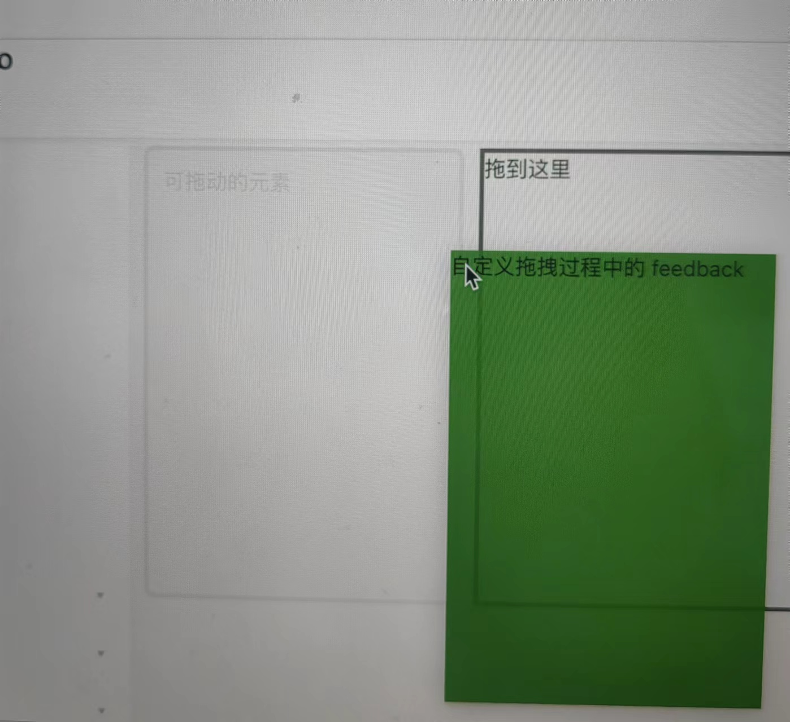

# HTML5 拖放操作

在定位设备的可视化媒体上，drag 操作是 mousedown 事件的默认行为，随后是一系列 mousemove 事件，最后通过释放鼠标来触发 drop 操作。

## 创建可拖动的内容

在浏览器器中，文本选区、图像和链接默认是可拖动的，效果图：

拖动链接


拖动图片



拖动选区



给文本选区、图像和链接之外的对象设置 draggable="true" 该元素将变为可拖动的，下面 class='draggable' 的 div 元素是可拖动的：

```html
<div class='container'>
    <div draggable="true" class='draggable'>可拖动的元素</div>
    <div class="dropTarget">拖到这里</div>
</div>
```

此时，你发现可以拖动 draggable="true" 的 div 元素，但是松开鼠标不会发生其他事情，要添加拖放功能，还需要使用 JavaScript API。

## 与拖放相关的事件

整个拖放过程涉及如下这些事件：

* dragstart
* drag
* dragenter
* dragleave
* dragover
* drop
* dragend

在拖放流程中，有一个起点，它是 drag 产生的地方，对应的元素被称为 Source node，比如链接、图片、div 等，还有一个 drop target，它是捕获拖放的区域，不是所有的元素都能作为 drop target，比如图片就不能，另外，还有 data payload，是 DataTransfer 对象。

### dragstart 和 dragend

dragstart 和 dragend 事件都在 Source node 上触发，dragstart 的默认行为是初始化拖放操作，dragend 没有默认行为，它们都能冒泡。

```javascript
const draggableItems = container.querySelectorAll('.draggable')

draggableItems.forEach(item => {
    item.addEventListener('dragstart', (e) => {
        e.target.style.opacity = '0.1'
        // e.preventDefault() // 取消事件，让元素不可拖动
    })

    item.addEventListener('dragend', (e) => {
        e.target.style.opacity = '1'
    })
})
```

在 dragstart 事件处理程序中，将被拖动的元素设置成半透明，在 dragend 事件处理程序中，将被拖动的元素设置成不透明。

### dragenter, dragover 和 dragleave

这三个事件在 drop target 上触发。dragenter 的默认行为是拒绝 immediate user selection 作为潜在的 drop target；dragover 的默认行为是将 event.dataTransfer.dropEffect 设置为 none；dragleave 没有默认行为。

```javascript
const dropTargets = rootRef.current.querySelectorAll('.dropTarget')
dropTargets.forEach(dropTarget => {
    // 当一个可拖动的元素进入它时，它触发 dragenter
    dropTarget.addEventListener('dragenter', (e: DragEvent) => {
        const target = e.target as HTMLDivElement
        if (target) {
            target.style.borderColor = 'red'
        }

    })
    // 当一个可拖动的元素离开它时，它触发 dragleave
    dropTarget.addEventListener('dragleave', (e: DragEvent) => {
        const target = e.target as HTMLDivElement
        if (target) {
            target.style.borderColor = '#666'
        }
    })

    // dragover 事件的默认行为是将 event.dataTransfer.dropEffect 设置为 none，如此 drop 事件将不在它上面触发
    dropTarget.addEventListener('dragover', (e: DragEvent) => {
        e.preventDefault()
    })
})
```

### drop

在 drop target 上绑定 drop 事件，在它的事件处理程序中完成最终的拖放操作，释放鼠标时要想 drop target 触发 drop 事件，必须取消 dragover 事件的默认行为。

```javascript
dropTarget.addEventListener('drop', (e: DragEvent) => {
    // 让 drop 不往上冒泡，如果冒泡到 document，浏览器可能有一些奇怪的重定向。
    e.stopPropagation()
    // do something
})
```

### 与拖放相关的事件总结

| 事件名 | target | 是否能取消 | 是否能冒泡 | drag data store 的 模式 | 默认行为 |
| --- | ----------- | ----- | ----- | ----- | ------ |
| dragstart | Source node | 能 | 能 | 可读/可写 | 初始化拖拽操作 |
| dragenter | drop target | 能 | 能 | 受保护的 | 拒绝 immediate user selection 作为潜在的 drop target |
|  dragover | drop target | 能 | 能 | 受保护的 | 将 event.dataTransfer.dropEffect 设置为 none |
| dragleave | drop target ｜ - | 能 | 受保护的 | 无 |
| dragend | Source node ｜ - | 能 | 受保护的 | Varies |
| drop | drop target | 能 | 能 | 只读 | Varies |

在不同的事件中 drag data store 的模式不同，这是为了保证拖放操作的安全，因为如果用户将敏感信息从一个文档拖到另一个文档，在这个过程中穿过第三个恶意文档，这个恶意文档可能会篡改数据。

## DataTransfer 对象

它通过 dragEvent.dataTransfer 访问，接口如下：

```typescript
interface DataTransfer {
    dropEffect: string;
    effectAllowed: string;
    readonly items: DataTransferItemList;
    readonly types: FrozenArray<string>;
    readonly files: FileList;
    
    setDragImage(image: Element, x: long, y: long) => undefined ;
    getData(format: string) => string;
    setData(format: string, data: string) => undefined;
    clearData(format?: string) => undefined;
}
```

### dropEffect

可能的取值有 "none", "copy", "link" 和 "move"，它用于控制拖拽过程中鼠标手势，主要在 dragenter 和 dragover 事件中设置。

copy



link 



move


### effectAllowed

可选值有 none、move、copy、copyLink、copyMove、linkMove、all、uninitialized。它指定拖放操作允许的效果，应该在 dragstart 事件中被设置成想要值。effectAllowed 与 dropEffect 的值有约束关系，如果我们设置 effectAllowed 值为 copyMove，那么 dropEffect 只有 copy 和 move 这两个值才有效。如果 effectAllowed 值和 dropEffect 值不匹配，drop target 则无法响应 drop 事件。

### setDragImage

setDragImage 方法用于自定义拖拽过程中的 feedback，代码如下：

```javascript
function onDragStart(event) {
 const target = e.target
  if (target) {
    target.style.opacity = '0.1'
   }

 if (event.dataTransfer) {
    e.dataTransfer.setDragImage(dragFallBackElement, 20,20)
 }
}
```

得到的效果区如下：



### setData, getData 和 clearData

在 dragstart 中用 setData 为拖动操作设置特定的数据，用 clearData 移除特定的数据，如果不传参数将移除所有的数据，在 drop 中用 getData 方法访问特定的数据，如果没有相应的数据则返回空字符串。代码如下：

```javascript
function onDragStart(e) {
 if (e.dataTransfer) {
    // e.dataTransfer.clearData()
    e.dataTransfer.setData('text/html', e.target.innerHTML)
    e.dataTransfer.setData('id',e.target.id)
 }
}

function onDrop(e) {
 e.stopPropagation()
 if (e.dataTransfer && target) {
    target.innerHTML = e.dataTransfer.getData('text/html')
    console.log(e.dataTransfer.getData('id'))
 }
}
```

### files

返回正在拖动的文件。

### items

它被称为 drag data store，用于保存在拖放操作期间需携带的数据。用 setData 添加的数据，除了通过 getData 访问还能通过 items 访问，files 字段保存的文件用 items 也能访问，items 的类型为 DataTransferItemList ，接口如下：

```javascript
interface DataTransferItemList {
    readonly length: number;
    add(data: string, type: string): DataTransferItem | null;
    add(data: File): DataTransferItem | null;
    clear(): void;
    remove(index: number): void;
    [index: number]: DataTransferItem;
}

interface DataTransferItem {
    readonly kind: "string" ｜ "file";
    readonly type: string;
    /** 如果 kind 是 'file'，则返回 File */
    getAsFile(): File | null;
   
    /** 如果 kind 是 'string'，在 callback 中将得到实际的数据 */
    getAsString(callback: FunctionStringCallback | null): void;
    webkitGetAsEntry(): FileSystemEntry | null;
}
```
