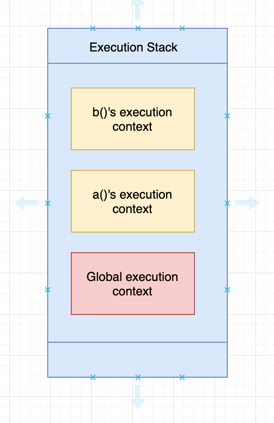
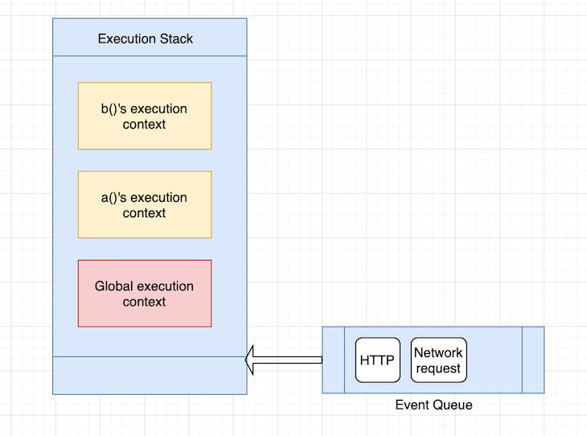
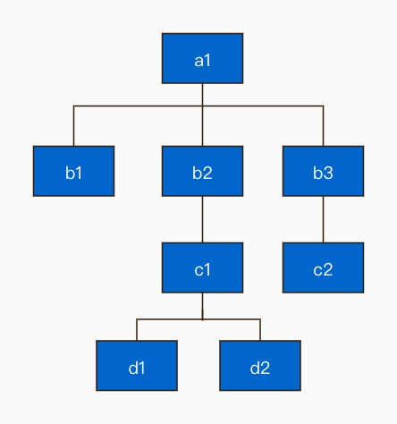
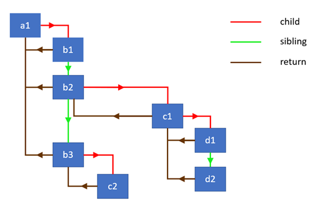
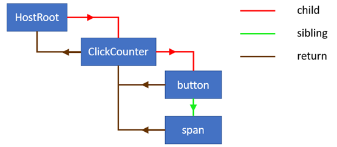

# 深入 React Fiber 内部

从 React 16 开始，React 重新实现了 reconciliation 算法，它被称为 Fiber Reconciler。在 React 16 之前你可能听说过 virtualDOM，那是老的 reconciliation 算法，老的 reconciler 算法使用了堆栈，所以它也被称为 Stack Reconciler。

我会先简单的介绍一下 Stack Reconciler，再介绍 Fiber Reconciler。

## Stack Reconciler

假设我们的应用程序如下：

```javascript

import React from 'react'
import ReactDOM from 'react-dom'

class Form extends React.Component {
    render() {
        return (
            <div className="form">
              {this.props.children}
            </div>
        )
    }
}
class App extends React.Component {
    render() {
        return (
            <Form> Submit </Form>
        )
    }
}
ReactDOM.render(<App />, document.getElementById('root'))

```

React 在渲染 `Form` 组件时会调用 render 方法去确定它渲染了什么元素，最终 React 看到 `Form` 渲染了一个带子元素的 div。React 会重复这个过程直到它知道页面上所有组件的底层 DOM 标签元素。这种为了知道 `App` 组件树的最底层的 DOM 标签元素的递归遍历过程称为 reconciliation, 在 reconciliation 的最后，React 就得到了 DOM 树的结构。

Stack Reconciler 是一个递归算法，更新应用程序状态会导致立即重新渲染整个子树，虽然它能满足要求，但是它也有一些局限性:

1. 它会立即应用 (apply) 每一次 update，在用户界面上这是不必要的，这可能会导致丢帧，降低用户体验。
2. 不同类型的 update 的优先级是一样的。但是从用户体验角度考虑，更新动画应该比更新数据存储有更高的优先级。

我先介绍一下帧率，帧率是图像连续出现在显示器上的频率，我们在电脑屏幕上看到的一切都是由在屏幕上以瞬间的速度播放的图像或帧组成的。通常情况下，为了让人眼感觉流畅和即时，视频需要以大约 30 帧每秒(FPS)的速度播放，高于这一数值的内容将提供更好的体验。如今大多数设备的屏幕刷新速度都是 60 FPS，1/60 = 16.67ms，这意味着每 16ms 就会显示一个新帧。因此如果 React 在屏幕上渲染的时间超过 16 毫秒，浏览器就会删除该帧，这会导致屏幕上的内容抖动。如果在每次状态变更的时候，React 的 reconciliation 算法都同步遍历整个子树并且重新渲染它，如果遍历超过了 16 ms，这将会导致丢帧。

由于上述原因，React 团队重写了 reconciliation 算法，新的算法叫做 Fiber Reconciler

## Fiber 要解决的问题

我们已经知道了 React 团队开发 Fiber 算法的原因，我们总结一下 Fiber 需要实现的功能：

1. 对不同类型的 update 分配不同的优先级
2. 暂停工作，稍后再来完成
3. 终止不需要完成的工作
4. 重新使用以前完成的工作

我们先研究一下 JS 如何处理执行上下文。

每当函数被执行的时候，js 引擎会创建一个函数执行上下文，除此之外，js 引擎启动之后，它也会创建一个保存全局变量的全局执行上下文。在 js 中这两种上下文使用堆栈数据结构来处理。假如有下面的函数调用：

```javascript
function a() {
  console.log("a 函数")
  b()
}

function b() {
  console.log("b 函数")
}

a()
```

js 引擎首先创建一个全局执行上下文并且将它 push 到执行栈中，然后它为 a 创建一个函数执行上下文并 push 到栈中，当 a 中的 b 被调用时，它为 b 创建一个函数执行上下文并且 push 到栈中。当 b 退出，js 引擎摧毁 b 的上下文，当 a 退出，js 引擎摧毁a的上下文。



在执行栈的底部，js 引擎有一个队列，这称为事件队列，事件队列用于处理浏览器中的异步操作，如：HTTP 请求等。



当执行栈为空或者当执行栈中只有全局执行上下文时，js 引擎会处理事件队列中的事件。回头看一下 stack reconciler，当 React 同步遍历组件树的时候，遍历发生在执行栈中，当有 update 发生，update 被 push 到事件队列，只有当执行栈为空的时候，update 才会被处理。如果你只是依赖 js 内置的执行栈，那么它会一直执行直到堆栈为空，这种情况我们不能中断执行栈也不能手动的操作堆栈帧，fiber 就是用来解决这个问题的。Fiber 是对堆栈的重新实现，专门用于 React 组件，你可以将 Fiber 看作虚拟堆栈帧。

在这里我要先介绍一个新版浏览器提供的 requestIdleCallback API，requestIdleCallback 可以在浏览器空闲期间对要调用的函数进行排队，用法如下：

```javascript
requestIdleCallback((deadline)=>{
    console.log(deadline.timeRemaining(), deadline.didTimeout)
});
```

在控制台运行上面的代码，Chrome 会打印出 49.9 false，它表示你有 49.9 毫秒去做任何你需要做的工作，你还没有用完所有分配的时间。只要浏览器有工作要处理，timerremaining 的值就会改变，所以应该经常检查它。

> 实际上，requestIdleCallback 的限制太大了，执行次数不够，无法实现流畅的 UI 渲染，所以 React 团队不得不实现他们自己的版本。

## fiber 链表

Fiber 算法不会进行递归遍历，Fiber 算法进行的是链表遍历。假设我们的组件树如下：



在 React 内部 Fiber 会创建了一个单链表，这个单链表就是 fiber 树，链表中的节点被称为 fiber 节点，fiber 节点通过 return、sibling 和 child 指针链接在一起：

1. child: 指向当前 fiber 节点的第一个子节点
2. sibling: 指向当前 fiber 节点的下一个兄弟节点
3. return: 指向当前 fiber 节点的父节点

下图展示了 fiber 节点之间的链接关系：



## 应用程序例子


代码如下：

```javascript
class ClickCounter extends React.Component {
    constructor(props) {
        super(props);
        this.state = {count: 0};
    }

    render() {
        return [
            <button key="1">Update counter</button>,
            <span key="2">{this.state.count}</span>
        ]
    }
}

ReactDOM.render(<ClickCounter />, document.getElementById('root'))
```

这个组件非常简单，它的 render 方法返回两个元素，分别是 button 和 span，只要点击按钮， ClickCounter 的状态就会更新，这进而导致 span 元素的文本更新。

在 reconciliation 期间，React 会执行各种各样的活动。在上面的例子中，修改 state 之后 React 执行的操作如下：

* 更新 ClickCounter 组件的 state 中的 count 属性值
* 检索并且对比 ClickCounter 组件的 children 和它们的 props
* 更新 span 元素的 props

在 reconciliation 期间这儿还有其他的活动需要执行，比如调用生命周期方法和更新 refs，在 Fiber 架构中这些活动被统称为工作。工作的类型取决于 react element 的类型，例如：对于 class 组件而言，React 需要创建一个实例，但是对于函数组件而言，它不需要这么做。在 React 中有多种不同类型的 elements，例如：类组件、函数组件、浏览器宿主组件(即：DOM nodes)和 portals 等。React element 的类型由 createElement 函数的第一个参数解决，这个方法通常在 render 方法中用于创建 element。

## React Elements 和 fiber 节点

在 React 中每个组件都对应了一个 UI 表现，它被 render 方法返回，我们可以将它称为模板。这是 ClickCounter 组件的模板：

```html
<button key="1" onClick={this.onClick}>Update counter</button>
<span key="2">{this.state.count}</span>
```

### React Elements

只要模板通过 JSX 编译器，我们将会得到一推 react elements，react elements 是 React 组件的 render 方法返回的结果，它不是 HTML。在 React 中我们可以不使用 JSX，我们可以像下面这样重写 ClickCounter 组件的 render 方法：

```javascript
class ClickCounter {
    ...
    render() {
        return [
            React.createElement(
                'button',
                {
                    key: '1',
                    onClick: this.onClick
                },
                'Update counter'
            ),
            React.createElement(
                'span',
                {
                    key: '2'
                },
                this.state.count
            )
        ]
    }
}
```

在 render 方法中调用 createElement 方法将会返回像下面这样的数据结构：

```javascript
[
    {
        $$typeof: Symbol(react.element),
        type: 'button',
        key: "1",
        props: {
            children: 'Update counter',
            onClick: () => { ... }
        }
    },
    {
        $$typeof: Symbol(react.element),
        type: 'span',
        key: "2",
        props: {
            children: 0
        }
    }
]
```

从上面的数据结构中，我们可以看出 React 给这两个 elements 添加了 $$typeof 属性以标识他们是 react elements，然后用 key、type 和 props 描述 element，这些属性的值来自于我们传递给 createElement 函数的参数。

### fiber 节点

在 reconciliation 阶段，从 render 函数返回的 react element 上的数据将被合并到 fiber 节点树中，每一个 react element 都有一个相应的 fiber 节点，与 react element 不同的是：在 re-render 的时候不会重新创建 fiber 节点，fiber 节点是可变的(mutable)，它用于保存组件的状态和 DOM。

在前面我们提到过针对不同类型的 react element， React 需要做不同的工作，对于类组件 ClickCounter 而言，它会调用生命周期函数和 render 方法，然而对于 span 这种宿主组件，它会执行 DOM 变更。不同类型的 react element 对应的 fiber 节点类型也不相同。下面罗列出了 fiber 节点的全部类型

```javascript
export type WorkTag = 0 | 1 | 2 | 3 | 4 | 5 | 6 | 7 | 8 | 9 | 10 | 11 | 12 | 13 | 14 | 15 | 16 | 17 | 18;
export const FunctionComponent = 0;
export const ClassComponent = 1;
export const IndeterminateComponent = 2; // Before we know whether it is function or class
export const HostRoot = 3; // Root of a host tree. Could be nested inside another node.
export const HostPortal = 4; // A subtree. Could be an entry point to a different renderer.
export const HostComponent = 5;
export const HostText = 6;
export const Fragment = 7;
export const Mode = 8;
export const ContextConsumer = 9;
export const ContextProvider = 10;
export const ForwardRef = 11;
export const Profiler = 12;
export const SuspenseComponent = 13;
export const MemoComponent = 14;
export const SimpleMemoComponent = 15;
export const LazyComponent = 16;
```

在 react element 第一次被转化成 fiber 节点的时候，React 会使用 element 上的数据创建一个 fiber，源代码位于：[createFiberFromTypeAndProps](https://github.com/facebook/react/blob/769b1f270e1251d9dbdce0fcbd9e92e502d059b8/packages/react-reconciler/src/ReactFiber.js#L414)，在随后的更新中，React 会重用已经创建的 fiber 节点，只是使用 react element 上的数据更新 fiber 节点上的的属性。

在上面的例子中，fiber 树像下面这个样子：



注意最顶部的 HostRoot，我们在下面的章节会介绍到。我们现在来看一下为 ClickCounter 组件创建的 fiber 节点的数据结构

```javascript
{
    stateNode: new ClickCounter,
    type: ClickCounter,
    alternate: null,
    key: null,
    updateQueue: null,
    memoizedState: {count: 0},
    pendingProps: {},
    memoizedProps: {},
    tag: 1,
    effectTag: 0,
    nextEffect: null
    ...
}
```

span 的 fiber 节点的数据构建

```javascript
{
    stateNode: new HTMLSpanElement,
    type: "span",
    alternate: null,
    key: "2",
    updateQueue: null,
    memoizedState: null,
    pendingProps: {children: 0},
    memoizedProps: {children: 0},
    tag: 5,
    effectTag: 0,
    nextEffect: null
    ...
}
```

我跳过了 child, sibling 和 return 字段，你能在[这里](https://github.com/facebook/react/blob/6e4f7c788603dac7fccd227a4852c110b072fe16/packages/react-reconciler/src/ReactFiber.js#L78)找到完整的 fiber 节点的数据结构

在 fiber 节点中有很多字段，在后面的章节中我会描述 alternate, effectTag 和 nextEffect 字段的用处，现在我们来看一下其他字段的含义：

stateNode 字段

保存与这个 fiber 节点相关的 DOM 节点或者其他类型的 react elements 的实例。

type 字段

保存与这个 fiber 节点相关的函数或者类。对类组件而言，它指向构造函数；对于 DOM 元素而言，它是 HTML 标签。

tag 字段

保存这个 fiber 节点的类型，在前面的部分我已经罗列出了所有的 fiber 节点类型。tag 字段决定了在 reconciliation 算法中 fiber 需要做哪些工作，正如前面提到的，要做哪些工作取决于 react element 的类型。在我们的例子中，ClickCounter 组件对应的 fiber 节点的 tag 属性值等于 1，它代表这是 ClassComponent，span 对应的 fiber 节点的 tag 属性值等于 5，它代表这是 HostComponent。

updateQueue 字段

状态更新、callback 调用和 DOM 更新的队列。

memoizedState 字段

上一次 render 时 fiber 节点的 state。当处理 update 时，它反映当前呈现在屏幕上的状态。

memoizedProps 字段

上一次 render 时 fiber 节点的 props

pendingProps 字段

从 react element 上得到的新的 props，需要被应用到子组件或者 DOM 元素上

key 字段

children group 上的唯一标识符，以帮助 React 找出哪些项目已更改，已添加或从列表中删除。它与React官方网站中描述[lists and keys](https://reactjs.org/docs/lists-and-keys.html#keys)有关。

### fiber 树的根节点

在每个 React 应用程序中都会有一个或多个充当容器的 DOM 元素，在我们的例子中它是 id 为 container 的 div 元素

```javascript
const domContainer = document.querySelector('#container');
ReactDOM.render(React.createElement(ClickCounter), domContainer);
```

React 为每个容器创建了一个 fiber root 对象，fiber root 对象的定义如下：

```javascript
type BaseFiberRootProperties = {
  // Any additional information from the host associated with this root.
  containerInfo: any,
  // Used only by persistent updates.
  pendingChildren: any,
  // The currently active root fiber. This is the mutable root of the tree.
  current: Fiber,

  // The following priority levels are used to distinguish between 1)
  // uncommitted work, 2) uncommitted work that is suspended, and 3) uncommitted
  // work that may be unsuspended. We choose not to track each individual
  // pending level, trading granularity for performance.
  //
  // The earliest and latest priority levels that are suspended from committing.
  earliestSuspendedTime: ExpirationTime,
  latestSuspendedTime: ExpirationTime,
  // The earliest and latest priority levels that are not known to be suspended.
  earliestPendingTime: ExpirationTime,
  latestPendingTime: ExpirationTime,
  // The latest priority level that was pinged by a resolved promise and can
  // be retried.
  latestPingedTime: ExpirationTime,

  // If an error is thrown, and there are no more updates in the queue, we try
  // rendering from the root one more time, synchronously, before handling
  // the error.
  didError: boolean,

  pendingCommitExpirationTime: ExpirationTime,
  // A finished work-in-progress HostRoot that's ready to be committed.
  finishedWork: Fiber | null,
  // Timeout handle returned by setTimeout. Used to cancel a pending timeout, if
  // it's superseded by a new one.
  timeoutHandle: TimeoutHandle | NoTimeout,
  // Top context object, used by renderSubtreeIntoContainer
  context: Object | null,
  pendingContext: Object | null,
  // Determines if we should attempt to hydrate on the initial mount
  +hydrate: boolean,
  // Remaining expiration time on this root.
  // TODO: Lift this into the renderer
  nextExpirationTimeToWorkOn: ExpirationTime,
  expirationTime: ExpirationTime,
  // List of top-level batches. This list indicates whether a commit should be
  // deferred. Also contains completion callbacks.
  // TODO: Lift this into the renderer
  firstBatch: Batch | null,
  // Linked-list of roots
  nextScheduledRoot: FiberRoot | null,
}
```

你可以使用 DOM 元素来访问它:

```javascript
const fiberRoot = query('#container')._reactRootContainer._internalRoot
```

fiber root 是 React 用来保存 fiber 树的地方，fiber 树存储在 fiber root 的 current 属性中。在前面的章节中，我们提到每个 fiber 节点都对应了一个类型，fiber 树第一个 fiber 节点的类型是 HostRoot，它是在内部创建的，并且它作为最顶层组件的 parent。有下面的关系：

```javascript
const hostRootFiberNode = fiberRoot.current
```

通过访问 fiberRoot.current（即：HostRoot ）可以查看 fiber 树，你也可以从组件实例中得到一个单独的 fiber 节点：

```javascript
// compInstance 对应的 fiber 节点
compInstance._reactInternalFiber
```

## Current 树和 WorkInProgress 树

在第一次 render 之后，React 会得到一个反映当前应用程序状态的 fiber 树，这个 fiber 树通常被称为 `current`。当 React 处理 update 时，它会构建一个 workInProgress 树，workInProgress 树反映了应用程序将来的状态。

所有的工作都在 `workInProgress` 树的 fiber 上执行。当 React 遍历 `current` 树时，它会为 `current` 树中的每个节点创建一个替代节点，这些替代节点构成 `workInProgress` 树，替代节点是使用 render 方法返回的 react element 的数据创建的。一旦 update 被处理并且所有相关工作都完成了，React 会将 `workInProgress` 树渲染到屏幕上，只要 `workInProgress` 树被渲染到屏幕上，`workInProgress` 树会变成 `current` 树。

在源码中，你可以看到很多从 current 树和 `workInProgress` 树中获取 fiber 节点的函数。函数签名大概是这样的：

```javascript
function updateHostComponent(current, workInProgress, renderExpirationTime)
```

每个 fiber 节点中都保存了一个它在其他树中的替代节点。即：`current` 树中的 fiber 节点指向 `workInProgress` 树中的 fiber 节点，反之亦然。

## Side-effects

你可以将 React 组件看作一个函数，它使用 state 和 props 来计算视图，像改变 DOM 或调用生命周期方法这样的活动都应该被认为是 Side-effects。大多数 state 和 props 的更新会导致 Side-effects，由于在 Fiber 架构中应用(apply) side-effects 被当作一个工作类型，所以 fiber 节点是一种方便跟踪 side-effects 的机制，每一个 fiber 节点都有与之相关联的 side-effects，它们被保存到 effectTag 字段中。fiber 中的 side-effects 基本上定义了在处理更新后需要为实例做的工作。对于宿主组件而言，需要做的工作有：添加、更新和移除元素；对于类 components 而言，需要做的工作有：更新 refs、调用 componentDidMount 和 componentDidUpdate 生命周期方法，在 React 中还有其他类型的 fiber 对应的其他 side-effects。

### Side-Effects 列表

React 会以非常快的速度去处理 update，为了达到高的性能水平，它使用了一些技术。其中一种方法是：创建一个线性的 fiber 节点列表，以致于快速的迭代 side-effects。迭代线性列表比树要快得多，而且会跳过没有 side-effects 的节点。side-effects 列表用于标记具有 DOM 更新或与之相关的其他 side-effects 的节点。此列表是 `workInProgress` 树的子集，并使用 nexteeffect 属性进行链接。

side-effects 列表将所有有 side-effects 的节点链接到一起。为了更形象，我画了下图所示的 fiber 节点树，其中黄色背景的节点代表有工作需要做。例如，由于状态更新导致将 c2 插入到 DOM 中，d2 和 c1 更改属性，b2 触发生命周期方法。side-effects 列表将把这些节点链接在一起，以便 React 稍后可以跳过其他节点


从下图你可以看到带有 side-effects 的节点是怎么被链接在一起的，在遍历节点时，React 使用 firstEffect 指针来确定列表的起始位置。所以上面的图可以用这样的线性表来表示：


## render 阶段和 commit 阶段

React 主要分两个阶段执行工作：render 和 commit，当有更新的时候，react 先进行 render 阶段再进行 commit 阶段。

在 render 阶段，React 会将 update 应用到组件上，并且计算出哪些 UI 需要被更新。如果是初始渲染，React 会为 render 方法返回的每个 react element 创建一个 fiber 节点，在接下来的更新中，现有 React element 的 fiber 节点将被重新使用并更新 fiber 上的数据。render 阶段的结果是得到一个标有 side-effects 的 fiber 节点链表。side-effects 描述了在接下来的 commit 阶段需要完成的工作，在 commit 阶段，React 遍历 effects list 时，会执行 DOM 更新和其他对用户可见更改。

render 阶段的工作可以异步执行，React 能够根据可用时间处理一个或者多个 fiber 节点，当剩余时间用完之后它停止处理并暂存已经完成的工作去响应一些事件，之后再从结束的地方继续处理，但有时它可能需要放弃已经完成的工作，重新从头开始处理。在 commit 阶段的工作是同步执行的，这是因为在这一阶段执行的工作导致了对用户可见的变更，例如DOM更新。

调用生命周期函数是 React 需要执行的一种任务，有些生命周期函数在 render 阶段调用，有些生命周期函数在 commit 阶段调用。在 render 阶段要调用的生命周期函数如下：

* `[UNSAFE_]`componentWillMount (deprecated)
* `[UNSAFE_]`componentWillReceiveProps (deprecated)
* getDerivedStateFromProps
* shouldComponentUpdate
* `[UNSAFE_]`componentWillUpdate (deprecated)
* render

经过前面的描述，我们已经知道了在 render 阶段不会生产像 DOM 更新这样的 side-effects，React 可以异步地处理组件的更新。

在 commit 阶段要调用的生命周期函数如下：

* getSnapshotBeforeUpdate
* componentDidMount
* componentDidUpdate
* componentWillUnmount

这些生命周期函数中可以包含 side effects 也能访问 DOM。现在我们对 render 阶段和 commit 阶段有了初步了解，下面我们继续深入

### render 阶段

reconciliation 算法总是使用 [renderRoot](https://github.com/facebook/react/blob/95a313ec0b957f71798a69d8e83408f40e76765b/packages/react-reconciler/src/ReactFiberScheduler.js#L1132)函数从最开始的 HostRoot fiber 节点开始，然而 React 会跳过不需要处理的 fiber 节点，直到它发现需要处理的节点。例如，如果你在组件树的深处调用 setState, React 将从顶部开始遍历，但会快速跳过父组件，直到它到达调用 setState 方法的组件。

#### render 阶段的主要步骤

所有的 fiber 节点都在 [work loop](https://github.com/facebook/react/blob/f765f022534958bcf49120bf23bc1aa665e8f651/packages/react-reconciler/src/ReactFiberScheduler.js#L1136) 中被处理,代码如下：

```javascript
function workLoop(isYieldy) {
  if (!isYieldy) {
    // Flush work without yielding
    while (nextUnitOfWork !== null) {
      nextUnitOfWork = performUnitOfWork(nextUnitOfWork);
    }
  } else {
    // Flush asynchronous work until the deadline runs out of time.
    while (nextUnitOfWork !== null && !shouldYield()) {
      nextUnitOfWork = performUnitOfWork(nextUnitOfWork);
    }
  }
}
```

在上面的代码中，nextUnitOfWork 保存了 `workInProgress` 树中的 fiber 节点的引用，该节点需要被处理。当 React 遍历 fiber 树时，它使用这个变量去判断是否有需要被处理的 fiber 节点。在处理了当前的 fiber 之后，该变量中要么是树中下一个 fiber 节点的引用要么是 null。如果 nextUnitOfWork 为 null，react 会退出 workLoop。这儿有四个主要的函数用于遍历树、开始或者完成工作：

* [performUnitOfWork](https://github.com/facebook/react/blob/95a313ec0b957f71798a69d8e83408f40e76765b/packages/react-reconciler/src/ReactFiberScheduler.js#L1056)
* [beginWork](https://github.com/facebook/react/blob/cbbc2b6c4d0d8519145560bd8183ecde55168b12/packages/react-reconciler/src/ReactFiberBeginWork.js#L1489)
* [completeUnitOfWork](https://github.com/facebook/react/blob/95a313ec0b957f71798a69d8e83408f40e76765b/packages/react-reconciler/src/ReactFiberScheduler.js#L879)
* [completeWork](https://github.com/facebook/react/blob/cbbc2b6c4d0d8519145560bd8183ecde55168b12/packages/react-reconciler/src/ReactFiberCompleteWork.js#L532)

为了演示如何使用它们，下面有遍历 fiber 节点的动画。我在演示中使用了这些函数的简化实现，每个函数接受一个 fiber 节点进行处理，随着 React 沿着树向下移动，你可以看到当前活动的 fiber 节点发生了变化。你可以在视频中清楚地看到算法是如何从一个分支到另一个分支的。它首先完成 children 的工作，然后再移动到 parent


先一下看我实现的 performUnitOfWork 和 beginWork 函数：

```javascript
function performUnitOfWork(workInProgress) {
    let next = beginWork(workInProgress);
    if (next === null) {
        next = completeUnitOfWork(workInProgress);
    }
    return next;
}

function beginWork(workInProgress) {
    console.log('work performed for ' + workInProgress.name);
    return workInProgress.child;
}
```

performUnitOfWork 函数接受 `workInProgress` 树中的一个 fiber 节点作为参数，并在一开始就调用 beginWork 函数，beginWork 函数是 fiber 节点执行工作的起点，出于演示的目的，我们只记录了 fiber 的名称。beginWork 函数总是返回下一个要处理的 child，它也可能是 null。如果 beginWork 的返回值不为 null，那么这个返回值会被附值给 workLoop 函数中的 nextUnitOfWork 变量，如果 beginWork 的返回值为 null，这表示已经遍历到分支的末尾，当前节点已经处理完成，一旦节点处理完成，React 将需要为这个节点的兄弟节点执行工作，并在此之后回溯到父节点。我实现的 completeUnitOfWork 如下：

```javascript
function completeUnitOfWork(workInProgress) {
    while (true) {
        let returnFiber = workInProgress.return;
        let siblingFiber = workInProgress.sibling;

        nextUnitOfWork = completeWork(workInProgress);

        if (siblingFiber !== null) {
            // If there is a sibling, return it
            // to perform work for this sibling
            return siblingFiber;
        } else if (returnFiber !== null) {
            // If there's no more work in this returnFiber,
            // continue the loop to complete the parent.
            workInProgress = returnFiber;
            continue;
        } else {
            // We've reached the root.
            return null;
        }
    }
}

function completeWork(workInProgress) {
    console.log('work completed for ' + workInProgress.name);
    return null;
}
```

可以看出 completeUnitOfWork 函数的目的是做一个大的 while 循环。当 workInProgress 没有子节点的时候，react 会进入这个函数，在完成当前 fiber 的工作之后，它检查当前 fiber 是否有兄弟节点，如果找到了兄弟节点，completeUnitOfWork 函数退出，并且返回兄弟节点。返回的这个兄弟节点被附值给 nextUnitOfWork 变量，然后 React 会从兄弟分支开始执行工作。需要注意的时候，在这个时候 React 只是完成了前面兄弟节点的工作，并没有完成父节点的工作，只有当所有的兄弟分支的工作做完之后才会完成父节点的工作并往上回溯。

正如你从前面代码中看到的那样，completeUnitOfWork 用于迭代，而进行工作发生在 beginWork 和 completeWork 函数中。

### Commit 阶段

Commit 阶段从 [completeRoot](https://github.com/facebook/react/blob/95a313ec0b957f71798a69d8e83408f40e76765b/packages/react-reconciler/src/ReactFiberScheduler.js#L2306) 函数开始，这是 React 更新 DOM 并调用 pre 和 post mutation 生命周期的地方

当 React 进入 Commit 阶段，它有两棵树和一个 side-effects 列表，一棵树代表了屏幕上当前呈现的状态，称为 `current` 树，另一棵树是在 render 阶段生成的 `workInProgress` 树，它表示将要呈现在屏幕上的状态。这里的 side-effects 列表是 `workInProgress` 树的子集，通过 nexteeffect 指针链接，side-effects 列表是执行 render 阶段的结果。render 阶段的关键在于确定哪些节点需要被插入、更新或删除，以及需要调用哪些组件的生命周期方法。

你可以通过 fiber root 的 current 属性访问 `current` 树，然后可以通过 `current` 树中的 HostRoot 节点的 alternate 属性访问到 `workInProgress` 树。

在 Commit 阶段主要运行的函数是 [completeRoot](https://github.com/facebook/react/blob/95a313ec0b957f71798a69d8e83408f40e76765b/packages/react-reconciler/src/ReactFiberScheduler.js#L523)，它做的事情如下：

1. 在标记了 Snapshot 的节点上调用 getSnapshotBeforeUpdate 生命周期方法
2. 在标记了 Deletion 的节点上调用 componentWillUnmount 生命周期方法
3. 执行所有的 DOM 插入、更新和删除
4. 将 `workInProgress` 树设置成 `current` 树
5. 在标记了 Placement 的节点上调用 componentDidMount 生命周期方法
6. 在标记了 Update 的节点上调用 componentDidUpdate 生命周期方法

在执行 DOM 变更之后，`workInProgress` 树才会被设置成 `current` 树

这里是 commitRoot 函数的要点

```javascript
function commitRoot(root, finishedWork) {
    commitBeforeMutationLifecycles()
    commitAllHostEffects();
    root.current = finishedWork;
    commitAllLifeCycles();
}
```

每个子函数都执行遍历，遍历 side-effects 列表并检查 effect 的类型。当它发现与函数的用途有关的 effect 时就执行它。

#### DOM 突变之前的 lifecycle methods（即：pre-mutation 生命周期）

下面是在 side-effects 列表上迭代并检查节点是否具有 Snapshot effect 的代码，[commitBeforeMutationLifecycles](https://github.com/facebook/react/blob/95a313ec0b957f71798a69d8e83408f40e76765b/packages/react-reconciler/src/ReactFiberScheduler.js#L442)

```javascript
function commitBeforeMutationLifecycles() {
  while (nextEffect !== null) {
    if (__DEV__) {
      ReactCurrentFiber.setCurrentFiber(nextEffect);
    }

    const effectTag = nextEffect.effectTag;
    if (effectTag & Snapshot) {
      recordEffect();
      const current = nextEffect.alternate;
      commitBeforeMutationLifeCycles(current, nextEffect);
    }

    // Don't cleanup effects yet;
    // This will be done by commitAllLifeCycles()
    nextEffect = nextEffect.nextEffect;
  }
}
```

对于类组件而言，这种 effect 意味着调用 getSnapshotBeforeUpdate 生命周期方法。

#### DOM updates

[commitAllHostEffects](https://github.com/facebook/react/blob/95a313ec0b957f71798a69d8e83408f40e76765b/packages/react-reconciler/src/ReactFiberScheduler.js#L376) 是 React 执行 DOM 更新的函数。该函数基本上定义了节点需要执行的操作类型并执行操作.

```javascript
function commitAllHostEffects() {
  while (nextEffect !== null) {
    recordEffect();

    const effectTag = nextEffect.effectTag;

    if (effectTag & ContentReset) {
      commitResetTextContent(nextEffect);
    }

    if (effectTag & Ref) {
      const current = nextEffect.alternate;
      if (current !== null) {
        commitDetachRef(current);
      }
    }
    let primaryEffectTag = effectTag & (Placement | Update | Deletion);
    switch (primaryEffectTag) {
      case Placement: {
        commitPlacement(nextEffect);
        // Clear the "placement" from effect tag so that we know that this is inserted, before
        // any life-cycles like componentDidMount gets called.
        // TODO: findDOMNode doesn't rely on this any more but isMounted
        // does and isMounted is deprecated anyway so we should be able
        // to kill this.
        nextEffect.effectTag &= ~Placement;
        break;
      }
      case PlacementAndUpdate: {
        // Placement
        commitPlacement(nextEffect);
        // Clear the "placement" from effect tag so that we know that this is inserted, before
        // any life-cycles like componentDidMount gets called.
        nextEffect.effectTag &= ~Placement;

        // Update
        const current = nextEffect.alternate;
        commitWork(current, nextEffect);
        break;
      }
      case Update: {
        const current = nextEffect.alternate;
        commitWork(current, nextEffect);
        break;
      }
      case Deletion: {
        commitDeletion(nextEffect);
        break;
      }
    }
    nextEffect = nextEffect.nextEffect;
  }
}
```

#### DOM 突变之后的 lifecycle methods（即：Post-mutation 生命周期）

[commitAllLifecycles](https://github.com/facebook/react/blob/95a313ec0b957f71798a69d8e83408f40e76765b/packages/react-reconciler/src/ReactFiberScheduler.js#L465) 是 React 调用所有剩余生命周期的地方，如： componentDidUpdate 和 componentDidMount。

```javascript
function commitAllLifeCycles(
  finishedRoot: FiberRoot,
  committedExpirationTime: ExpirationTime,
) {
  while (nextEffect !== null) {
    const effectTag = nextEffect.effectTag;

    if (effectTag & (Update | Callback)) {
      recordEffect();
      const current = nextEffect.alternate;
      commitLifeCycles(
        finishedRoot,
        current,
        nextEffect,
        committedExpirationTime,
      );
    }

    if (effectTag & Ref) {
      recordEffect();
      commitAttachRef(nextEffect);
    }

    const next = nextEffect.nextEffect;
    // Ensure that we clean these up so that we don't accidentally keep them.
    // I'm not actually sure this matters because we can't reset firstEffect
    // and lastEffect since they're on every node, not just the effectful
    // ones. So we have to clean everything as we reuse nodes anyway.
    nextEffect.nextEffect = null;
    // Ensure that we reset the effectTag here so that we can rely on effect
    // tags to reason about the current life-cycle.
    nextEffect = next;
  }
}
```

## 总结

Fiber 架构中有三个关键的链表，分别是：`current` 树、`workInProgress` 树和 `Side-Effect` 列表，这些链表将 fiber 链接在一起，使暂停、重用和中止处理成为可能。在 render 阶段不会生产像 DOM 更新这样的 side-effects，React 可以异步地处理组件的更新，render 阶段的目的是为了确认那些节点应该有 side-effects，在 commit 阶段才会执行 side-effects。