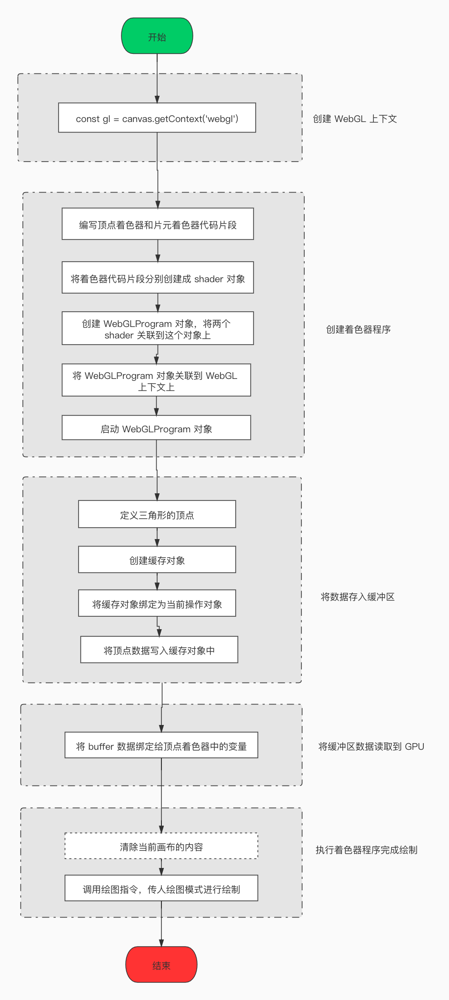

## 给视频和图片添加特效

现在很多 app 都有给视频或者图片增加特效或滤镜的功能，在这篇文章中将会介绍如何在 web 上实现这些功能。图片和视频的处理过程基本上是相同的，你可以认为图片是视频中的单一帧，但是处理视频的时候还是有一些值得注意的事项，在最后我会进行介绍。

## 怎么得到图片上的像素数据

通常有三种基本的图像处理：

1. 单一像素特效，比如：修改饱和度、亮度和对比度等。这一类的图像处理只与单个像素点相关
2. 多像素特效，比如：模糊和锐化等。这一类的图像处理与多个像素点相关
3. 整幅图特效，比如：裁剪，倾斜，拉伸等

这三种处理类型都需要获取原图的像素数据，修改原图的像素数据，然后创建新的图片，在这个过程中都需要使用到画布，不过我们可以选择是使用 CPU 处理(2D canvas)还是使用 GPU 处理(WebGL),我会分布介绍这两种方式

### 2D canvas

首先要将图片绘制到画布上

```javascript
const source = document.getElementById('source-image');

// Create the canvas and get a context
const canvas = document.createElement('canvas');
const context = canvas.getContext('2d');

// Set the canvas to be the same size as the original image
canvas.width = source.naturalWidth;
canvas.height = source.naturalHeight;

// Draw the image onto the top-left corner of the canvas
context.drawImage(theOriginalImage, 0, 0);
```

获取画布上的像素数据

```javascript
const imageData = context.getImageData(0, 0, canvas.width, canvas.height);
const pixels = imageData.data;
```

`pixels`是一个`Uint8ClampedArray`类型的数组，它的长度是`canvas.width * canvas.height * 4`，数组中的每四个元素代表一个像素的颜色，这四个元素分别代表红色、绿色、蓝色和alpha(透明度)，像素从左上角开始排序，从左到右，从上到下。

```javascript
pixels[0]: 第一个像素红色通道的值
pixels[1]: 第一个像素绿色通道的值
pixels[2]: 第一个像素蓝色通道的值
pixels[3]: 第一个像素 alpha 通道的值
...
```

给定一个坐标 (x,y) 你可以通过如下的方式得到这个位置像素信息：

```javascript
const index = (x + y * imageWidth) * 4;
const red = pixels[index];
const green = pixels[index + 1];
const blue = pixels[index + 2];
const alpha = pixels[index + 3];
```

得到像素数据之后，你可以对这些像素数据进行修改(在这一步你可以将你想要的特效应用到图片上)，然后将修改之后的像素数据绘制到画布上

```javascript
context.putImageData(imageData, 0, 0);
```

### WebGL

WebGL 是一个很大的主题，要想在一篇文章中介绍清楚这不是一件容易的事，如果你想学习关于更多 WebGL 的知识点，你可以阅读我在文章末尾准备的文章。在这篇文章中只简单的介绍一下用 WebGL 处理单张图片我们需要做些什么。

WebGL 不是 3D 图像 API，它只擅长做一件事，那就是绘制三角形。在你的应用程序中，你必须用三角形来描述你真正想要画的东西。在绘制 2D 图像的情况下，这非常简单，因为矩形是两个相似的直角三角形，它们的斜边在相同的位置。

基本的流程是：
1. 创建 WebGL 上下文
2. 创建着色器程序
3. 将数据存入缓冲区
4. 将缓冲区数据读取到 GPU
5. 执行着色器程序进行绘制



在绘制过程中有两种类型的着色器，分别是顶点着色器和片元着色器，顶点着色器使用顶点缓冲区的数据来计算在画布上绘制的每个三角形的三个点的位置。执行完顶点着色器程序之后，GPU 就知道画布中的哪些像素需要被绘制，然后片元着色器会对每像素点调用一次，返回这个像素点应该被绘制的颜色，片元着色器可以从一个或多个纹理中读取信息来确定像素点的颜色。下面是一个从纹理中取颜色的片元着色器代码：

```
precision mediump float;
// 坐标
varying vec2 v_texture;
// 纹理
uniform sampler2D u_sampler;

void main(){
    // 使用坐标从纹理中取颜色，将颜色取出来之后，你可以根据自己的需求修改
    gl_FragColor = texture2D(u_sampler, v_texture);
}
```

### 应该使用 2D canvas 还是 WebGL 来图像处理

对专业的高质量图像进行实时处理，你都应该使用 WebGL。在 GPU 处理图像意味着每个像素可以在它自己的线程中进行计算，这使得在 GPU 上处理图像的速度比在 CPU 上处理图像的速度可以快一个数量级，这对于任何实时图像处理，处理速度是至关重要的。

如果你只是做一次性转换，你可以考虑使用 2D canvas

## 特效类型

在前面部分我提到有三种基本的图像处理，接下来我分别对这三种进行介绍

### 单一像素特效

这类特效比另位两类特效都要简单，因为它将单个像素点的颜色值作为输入，最终得到另一个颜色值。例如，可以将像素的红、绿、蓝值乘以一个亮度值来实现亮度控制，亮度值为0将使图像完全黑，值为 1 将保持图像不变。大于 1 的值将使图像更亮。

```javascript
const brightness = 1.1; // 让图像亮度提亮 10%
for (let i = 0; i < imageData.data.length; i += 4) {
  imageData.data[i] = imageData.data[i] * brightness;
  imageData.data[i + 1] = imageData.data[i + 1] * brightness;
  imageData.data[i + 2] = imageData.data[i + 2] * brightness;
}
```

如果使用 WebGL 进行处理，片元着色器代码如下：

```
precision mediump float;
// 坐标
varying vec2 v_texture;
// 纹理
uniform sampler2D u_sampler;

void main(){
    vec4 color = texture2D(u_sampler, v_texture);
    float brightness = 1.1;
    gl_FragColor = vec4(color.rgb * brightness, color.a);
}
```

有些特效可能需要获得一些额外的信息，比如图像的平均亮度，但是这些信息只需要计算一次，然后在之后的处理中重复使用。

### 多像素特效

这类特效会使用邻近像素的颜色来决定当前像素的颜色值，在这类特效处理过程中，你需要读取图像的原始颜色，而前面的示例中我们会直接更新图像的原始颜色，这儿有一个最简单的解决方案，那就是在图像处理之前创建一个 imageData 的副本

```javascript
const originalPixels = new Uint8Array(imageData.data);
```

如果使用 WebGL 处理图像，你不需要创建一个 imageData 的副本，因为着色器不会修改输入纹理的颜色值

高斯模糊是一种常见的多像素特效，在高斯模糊处理过程中会使用到一个卷积滤波器，它会使用邻近的多个像素颜色来计算结果像素的颜色值，详细的过程你可以参考[图片美化](/documents/visualization/beautify/)，如下是一个 3 * 3 的高斯模糊卷积核

```
| 0  1  0 |
| 1  4  1 |
| 0  1  0 |
```

如果你想要计算坐标为(23,19)的像素点的输出颜色，那么你要取坐标(23，19)周围的8个像素点以及像素本身，并将每个像素的颜色值乘以相应的权重。

```
(22, 18) x 0    (23, 18) x 1    (24, 18) x 0
(22, 19) x 1    (23, 19) x 4    (24, 19) x 1
(22, 20) x 0    (23, 20) x 1    (24, 20) x 0
```

然后将结果加在一起，最后还需要进行归一化处理，得到的结果就是坐标为(23,19)的像素点的输出颜色

```javascript
const kernel = [[0, 1, 0],
                [1, 4, 1],
                [0, 1, 0]];

for (let y = 0; y < imageHeight; y++) {
  for (let x = 0; x < imageWidth; x++) {
    let redTotal = 0;
    let greenTotal = 0;
    let blueTotal = 0;
    let weightTotal = 0;
    for (let i = -1; i <= 1; i++) {
      for (let j = -1; j <= 1; j++) {
        // 过滤掉图像边缘的像素
        if (x + i > 0 && x + i < imageWidth &&
            y + j > 0 && y + j < imageHeight) {
          const index = (x + i + (y + j) * imageWidth) * 4;
          const weight = kernel[i + 1][j + 1];
          redTotal += weight * originalPixels[index];
          greenTotal += weight * originalPixels[index + 1];
          blueTotal += weight * originalPixels[index + 2];
          weightTotal += weight;
        }
      }
    }

    const outputIndex = (x + y * imageWidth) * 4;
    imageData.data[outputIndex] = redTotal / weightTotal;
    imageData.data[outputIndex + 1] = greenTotal / weightTotal;
    imageData.data[outputIndex + 2] = blueTotal / weightTotal;
  }
}
```

### 整幅图特效

这类特效中的某一些是很简单的，比如使用 2D canvas 处理图像的时候，裁剪和缩放只需要调用一个 API

```javascript
// 设置画布的大小
canvas.width = source.naturalWidth - 100;
canvas.height = source.naturalHeight - 100;

// 将图像的这个区域绘制到画布上
const sx = 50; 
const sy = 50; 
const sw = source.naturalWidth - 100; 
const sh = source.naturalHeight - 100; 

// 将图像绘制到画布上这个区域
const dx = 0; 
const dy = 0; 
const dw = canvas.width; 
const dh = canvas.height;

context.drawImage(theOriginalImage,
    sx, sy, sw, sh,
    dx, dy, dw, dh);
``` 

使用 2D canvas 旋转平移，只需要在绘制之前调用 API 变换坐标系就可以了

```javascript
// 将 X 轴往右移动
context.translate(-canvas.width / 2, 0);

// 将 Y 轴 沿 X 轴翻转
context.scale(-1, 1);

// 将坐标系顺时针旋转 90 度
context.rotate(Math.PI / 2);
```

你也可以将 2D 转换写成一个 2 * 3 的矩阵，然后调用 setTransform，下面的一个应用旋转平移的例子：

```javascript
const matrix = [
    Math.cos(rot) * x1, (-Math.sin(rot)) * x2, tx,
    Math.sin(rot) * y1, Math.cos(rot) * y2,    ty,
];

context.setTransform(
  matrix[0], matrix[1], matrix[2],
  matrix[3], matrix[4], matrix[5],
);
```

更复杂的效果，如镜头扭曲或水波纹会涉及到将偏移位置的像素点颜色应用到目标像素点。例如，要产生水平水波纹的效果，可以根据 y 坐标偏移源像素的x坐标。

```javascript
for (let y = 0; y < canvas.height; y++) {
  const xOffset = 20 * Math.sin(y * Math.PI / 20);
  for (let x = 0; x < canvas.width; x++) {
    // Clamp the source x between 0 and width
    const sx = Math.min(Math.max(0, x + xOffset), canvas.width);

    const destIndex = ((y * canvas.width) + x) * 4;
    const sourceIndex = ((y * canvas.width) + sx) * 4;

    imageData.data[destIndex] = originalPixels.data[sourceIndex];
    imageData.data[destIndex + 1] = originalPixels.data[sourceIndex + 1];
    imageData.data[destIndex + 2] = originalPixels.data[sourceIndex + 2];
  }
}
```


## 给视频加特效

图片和视频的处理过程基本上是相同的，你可以认为视频是由一系列图片组成的，2D canvas 和 WebGL 在画布上绘制视频的时候只会绘制视频的当前帧

2D Canvas

```javascript
context.drawImage(video, 0, 0);
```

WebGL 

```javascript
// 将视频作为纹理
gl.texImage2D(gl.TEXTURE_2D, 0, gl.RGBA, gl.RGBA, gl.UNSIGNED_BYTE, video);
```

如果你想给播放的视中添加特效，你需要在每一帧上使用 drawImage/texImage2D 来抓取一个新的视频帧，并在每个浏览器动画帧上处理当前帧的像素。

```javascript
const draw = () => {
    requestAnimationFrame(draw);

    context.drawImage(video, 0, 0);

    // ...image processing goes here
}
```

当处理视频时，处理速度变得特别重要。对于静态图像，用户可能不会注意到点击按钮和应用特效之间有 100 毫秒的延迟。然而，在动画中，仅 16 毫秒的延迟就会导致明显的抖动。

## 相关阅读推荐

1. [WebGL Fundamentals](https://webglfundamentals.org/webgl/lessons/zh_cn/)
2. [Kernel (image processing)](https://en.wikipedia.org/wiki/Kernel_(image_processing))
3. [Image Kernels](https://setosa.io/ev/image-kernels/)
4. [2D canvas transformations](https://developer.mozilla.org/en-US/docs/Web/API/Canvas_API/Tutorial/Transformations)